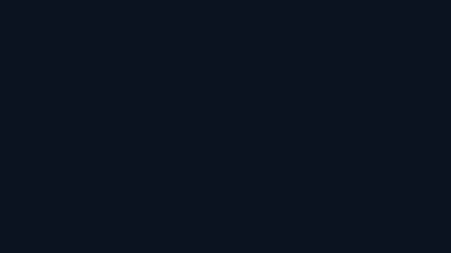

<p align="center">
  
</p>

<h1 align="center">polycopy</h1>

<p align="center">
  <em>Copie automatiquement les meilleurs traders Polymarket sans lever le petit doigt.</em>
</p>

<p align="center">
  
  
  
  
</p>

> [!CAUTION]
> **🚧 Bot en phase de test — fortement déconseillé en condition réelle pour le moment.**
>
> Ce code est un prototype personnel. Aucune garantie sur le fonctionnement, la sécurité, la rentabilité ni la conformité juridique. Les bugs peuvent coûter du capital réel. **Reste en `DRY_RUN=true` tant que tu n'as pas lu et compris l'intégralité du code et de la documentation.** Lis l'[Avertissement](#avertissement) avant tout usage.

<p align="center">
  
</p>

---

## Sommaire

- [Quickstart (5 minutes)](#quickstart-5-minutes)
- [Tutorial pas-à-pas](#tutorial-pas-à-pas)
- [FAQ](#faq)
- [Comparaison avec d'autres bots Polymarket](#comparaison-avec-dautres-bots-polymarket)
- [Hall of Fame — wallets publics notables](#hall-of-fame--wallets-publics-notables)
- [Architecture & stack](#architecture--stack)
- [Variables d'environnement](#variables-denvironnement)
- [Going live](#going-live-passage-du-dry-run-au-mode-réel)
- [Roadmap](#roadmap)
- [Avertissement](#avertissement)

---

## Quickstart (5 minutes)

```bash
# 1. Clone
git clone https://github.com/<user>/polycopy ~/code/polycopy && cd ~/code/polycopy

# 2. Setup (idempotent, ~2 min)
bash scripts/setup.sh

# 3. Édite .env avec un wallet à copier (TARGET_WALLETS=0x...).
#    Tu peux utiliser une adresse publique du Hall of Fame ci-dessous.

# 4. Lance le bot en mode safe (aucun ordre envoyé)
source .venv/bin/activate
python -m polycopy --dry-run
```

Après 3-5 secondes, ton terminal affiche un écran statique :

<p align="center">
  
</p>

Active le dashboard local pour la vue temps réel :

```bash
DASHBOARD_ENABLED=true python -m polycopy --dry-run
# puis ouvre http://127.0.0.1:8787/
```

<p align="center">
  
</p>

**C'est tout.** Le bot détecte les trades de ton wallet cible et log ce qu'il **ferait**, **sans jamais envoyer d'ordre**.

---

## Tutorial pas-à-pas

7 étapes pour aller du clone à un bot dry-run instrumenté en 30 minutes. Sections pliables — déroule celle qui t'intéresse.

<details>
<summary><strong>Étape 1 — Installer WSL Ubuntu (si Windows)</strong></summary>

Ce bot tourne dans un environnement Linux natif. Sur Windows, utilise WSL Ubuntu (le sous-système Linux officiel Microsoft).

```powershell
# PowerShell admin :
wsl --install -d Ubuntu
# puis redémarre, lance "Ubuntu" depuis le menu démarrer, crée ton user.
```

Pour la suite, **toujours** travailler depuis le shell WSL bash (`/home/<user>/code/polycopy`), **jamais** depuis `/mnt/c/...` (I/O 10× plus lent sur drvfs).

Sur macOS/Linux : passe à l'étape 2 directement.

</details>

<details>
<summary><strong>Étape 2 — Clone + bootstrap automatique</strong></summary>

Le script `scripts/setup.sh` est **idempotent** (rejouable) et fait : création venv, install deps, copie `.env.example` → `.env`, smoke test.

```bash
git clone https://github.com/<user>/polycopy ~/code/polycopy
cd ~/code/polycopy
bash scripts/setup.sh
```

Sortie attendue (~2 min) :

```
✅ venv créé
✅ deps installées (39 packages)
✅ .env créé depuis .env.example
✅ smoke test : 1 ligne JSON polycopy_starting affichée
```

Détail des étapes : [docs/setup.md](docs/setup.md).

</details>

<details>
<summary><strong>Étape 3 — Choisir et configurer ton premier wallet à copier</strong></summary>

Ouvre `.env` dans ton éditeur :

```bash
code .env  # ou nano, vim, ...
```

<p align="center">
  
</p>

Cherche `TARGET_WALLETS=` et mets une adresse publique connue. Pour démarrer, **prends-en une du [Hall of Fame](#hall-of-fame--wallets-publics-notables)** plus bas — ce sont des wallets dont le track record a été documenté publiquement.

```env
TARGET_WALLETS=0x1111111111111111111111111111111111111111
DRY_RUN=true
COPY_RATIO=0.01
MAX_POSITION_USD=1
```

Note : `MAX_POSITION_USD=1` te limite à $1 max par position **même en live**. Garde-fou ceinture-bretelles avant d'oser plus.

</details>

<details>
<summary><strong>Étape 4 — Lancer le bot (CLI silent)</strong></summary>

```bash
source .venv/bin/activate
python -m polycopy --dry-run
```

Tu vois un écran statique avec les 6 modules actifs (Watcher, Strategy, Executor, Monitoring, Dashboard, Discovery) + le chemin du fichier log + l'URL dashboard si activé.

Les **logs JSON détaillés** vont dans `~/.polycopy/logs/polycopy.log` (rotation 10 MB × 10 fichiers). Pour les lire en live :

```bash
tail -f ~/.polycopy/logs/polycopy.log
```

Pour restaurer le mode "JSON sur stdout" historique (M1..M8) :

```bash
python -m polycopy --dry-run --verbose
```

Mode daemon (systemd, nohup, cron) — zéro stdout :

```bash
python -m polycopy --dry-run --no-cli > /dev/null 2>&1 &
```

</details>

<details>
<summary><strong>Étape 5 — Activer le dashboard local (optionnel mais recommandé)</strong></summary>

Édite `.env` :

```env
DASHBOARD_ENABLED=true
DASHBOARD_HOST=127.0.0.1   # ⚠️ localhost-only par défaut
DASHBOARD_PORT=8787
```

Relance le bot, puis ouvre `http://127.0.0.1:8787/` :

<p align="center">
  
</p>

Pages disponibles :
- **Home** — KPIs + sparklines + dernières détections (auto-refresh).
- **Détection / Stratégie / Exécution / Positions** — listes paginées.
- **PnL** — area chart Chart.js + overlay drawdown + timeline milestones.
- **Traders** — table avec jauge SVG par score.

<p align="center">
  
</p>

- **Logs** — viewer du fichier `polycopy.log` avec filtres level + recherche texte + live tail (polling 2 s) + bouton télécharger.
- **Backtest** — visualisation du rapport `score_backtest.py` (M5).

</details>

<details>
<summary><strong>Étape 6 — Activer les alertes Telegram (5 min)</strong></summary>

1. Sur Telegram, cherche `@BotFather` (compte officiel vérifié) → envoie `/newbot`.
2. Choisis un nom (ex: `mon polycopy bot`) puis un username finissant par `bot`.
3. BotFather répond avec un token `123456789:ABC...`.

<p align="center">
  
</p>

4. Ouvre la conversation de TON bot, envoie-lui `/start`.
5. Récupère ton chat_id : ouvre `https://api.telegram.org/bot<TON_TOKEN>/getUpdates` dans un navigateur, lis `"chat": {"id": 12345678, ...}`.
6. Édite `.env` :

```env
TELEGRAM_BOT_TOKEN=<ton_token>
TELEGRAM_CHAT_ID=12345678
TELEGRAM_STARTUP_MESSAGE=true
TELEGRAM_HEARTBEAT_ENABLED=true
TELEGRAM_DAILY_SUMMARY=true
TG_DAILY_SUMMARY_HOUR=9
```

7. Redémarre le bot — tu reçois immédiatement un message de démarrage avec version, modules actifs, lien dashboard.

Le bot reste **emitter-only** : il ne lit aucune commande entrante. Détails M7 dans [`docs/setup.md` §16](docs/setup.md).

</details>

<details>
<summary><strong>Étape 7 — Passer en live (avec checklist sécurité)</strong></summary>

> [!WARNING]
> **Garde le warning du haut en tête.** Le passage en live engage du capital réel. Lis chaque ligne ci-dessous.

Checklist obligatoire :

- [ ] Tu as fait tourner le bot ≥ 7 jours en `DRY_RUN=true` sans crash.
- [ ] Tu as observé les `order_simulated` dans les logs et compris ce que le bot ferait.
- [ ] Tu as **vérifié la légalité de Polymarket dans ta juridiction** (cf. [FAQ](#faq)).
- [ ] Tu connais le mécanisme du **kill switch** (drawdown ≥ `KILL_SWITCH_DRAWDOWN_PCT`).
- [ ] Tu as activé Telegram pour être alerté en cas de problème.
- [ ] `MAX_POSITION_USD=1` (un dollar) pour ton tout premier run live.

Édite `.env` :

```env
POLYMARKET_PRIVATE_KEY=0x<ta_clé_privée>     # NE COMMIT JAMAIS
POLYMARKET_FUNDER=0x<ton_proxy_address>      # depuis ton profil Polymarket
POLYMARKET_SIGNATURE_TYPE=2                  # 2 = Gnosis Safe (le plus fréquent)
DRY_RUN=false
MAX_POSITION_USD=1
```

Lance :

```bash
python -m polycopy
```

Si une clé manque, le bot **refuse de démarrer** avec un `RuntimeError` clair (4 garde-fous M3 + 1 M8). Surveille les logs `order_filled` / `order_rejected` ; vérifie chaque transaction sur polymarket.com.

</details>

---

## FAQ

<details>
<summary><strong>Est-ce légal dans mon pays ?</strong></summary>

**Polymarket est inaccessible (officiellement) depuis plusieurs juridictions** : États-Unis (interdit aux résidents par CFTC), Royaume-Uni, France, Singapour, Belgique, Australie, Thaïlande, et probablement d'autres (liste **non exhaustive**, susceptible d'évoluer).

Le code de polycopy lui-même est neutre — c'est un script Python qui appelle des APIs publiques. Mais l'utilisation de Polymarket peut violer :
- ta réglementation locale sur les jeux d'argent / paris en ligne,
- la réglementation sur les actifs numériques,
- les conditions d'usage de Polymarket (qui interdit les utilisateurs depuis certaines régions).

**L'auteur de polycopy ne donne aucun conseil juridique. Vérifie avec un juriste avant tout usage en argent réel dans une juridiction sensible.**

</details>

<details>
<summary><strong>Combien je dois mettre au départ ?</strong></summary>

**Minimum pour un test live** : $5 en USDC sur ton proxy wallet Polymarket, avec `MAX_POSITION_USD=1`. Laisse tourner 1-2 semaines, regarde le dashboard `/pnl`. Si tu es satisfait, augmente par paliers : `$5 → $20 → $100 → ...`. Ne dépasse jamais ce que tu peux perdre **en intégralité, du jour au lendemain**.

Avant tout live, fais tourner ≥ 7 jours en `DRY_RUN=true` avec `DRY_RUN_REALISTIC_FILL=true` (M8) pour observer le PnL virtuel sans risque.

</details>

<details>
<summary><strong>Comment je sais que le bot tourne bien ?</strong></summary>

3 signaux indépendants :

1. **Dashboard** : `http://127.0.0.1:8787/healthz` répond `200 {"status":"ok"}`.
2. **Telegram heartbeat** (si activé en M7) : tu reçois un "💚 polycopy actif" toutes les 12 h.
3. **Logs** : `tail -f ~/.polycopy/logs/polycopy.log | jq .event` fait défiler des events.

Si l'un des 3 stoppe : process probablement mort.

</details>

<details>
<summary><strong>Que faire si mon PnL plonge ?</strong></summary>

- Si `drawdown ≥ KILL_SWITCH_DRAWDOWN_PCT=20%`, le bot **se coupe automatiquement** (mode live uniquement, jamais en dry-run) + alerte Telegram CRITICAL.
- Sinon, options manuelles :
  1. `DRY_RUN=true` + redémarre → continue d'observer sans risque.
  2. Baisse `MAX_POSITION_USD` (par 2 minimum).
  3. Désactive le wallet sous-performant : `sqlite3 polycopy.db "UPDATE target_traders SET active=0 WHERE wallet_address='0x...';"`.

</details>

<details>
<summary><strong>Quelle est la stack ? Pourquoi Python + SQLite ?</strong></summary>

- **Python 3.11+** (asyncio, TaskGroup) — readable, batteries included.
- `py-clob-client` (SDK officiel Polymarket pour signature CLOB).
- `httpx` async + `tenacity` retry.
- **SQLAlchemy 2.0** + `aiosqlite` — single-process, pas de besoin Postgres pour 1 user.
- Pydantic v2 pour la config + DTOs.
- `structlog` JSON.
- FastAPI + HTMX + Tailwind CDN + Chart.js pour le dashboard (zéro `node_modules`).
- `rich` pour le CLI silent (M9).

Migration Postgres triviale : change `DATABASE_URL` en `postgresql+asyncpg://...`.

</details>

<details>
<summary><strong>Quels sont les coûts cachés (gas, fees, slippage) ?</strong></summary>

- **Gas Polygon** : payé par le proxy wallet en MATIC, ~$0.001 par tx. À financer **avant** ton premier ordre.
- **Trading fees Polymarket** : 0 % maker, ~0 % taker (au moment de la rédaction — vérifie sur leur site).
- **Slippage** : limité par `MAX_SLIPPAGE_PCT=2.0` côté bot. Peut rejeter des ordres si le marché bouge entre détection et envoi.
- **Latence** : ~10-15 secondes détection → exécution. Insuffisant pour les marchés ultra-réactifs (news live).

</details>

<details>
<summary><strong>Bot vs trading manuel : quel intérêt ?</strong></summary>

Avantages bot :
- Suit 24/7 sans burn-out.
- Discipline du sizing (jamais de FOMO).
- Audit complet (chaque décision est loggée + dashboard).
- Backtest possible (`scripts/score_backtest.py`).

Inconvénients :
- Latence 10-15 s vs ~5 s humain réactif.
- Pas de **discrétion contextuelle** (le bot copie même les trades absurdes).
- **Bug = perte réelle**. Le humain a au moins l'intuition de ne pas appuyer sur "OK" si quelque chose semble louche.

Le bon usage : bot pour les wallets que tu ne pourrais pas suivre toi-même, manuel pour tes convictions personnelles.

</details>

<details>
<summary><strong>Où signaler un bug / proposer une amélioration ?</strong></summary>

GitHub issues sur ce repo. PR welcome après discussion sur l'issue. Conventions : voir [CLAUDE.md](CLAUDE.md) (conventions internes) + commits `feat(...)` / `fix(...)` / `docs(...)`.

</details>

---

## Comparaison avec d'autres bots Polymarket

| Critère | **polycopy** | [MrFadiAi/Polymarket-bot](https://github.com/MrFadiAi/Polymarket-bot)<sup>1</sup> | mock concurrent #2<sup>2</sup> |
|---|---|---|---|
| Open-source | ✅ MIT | ✅ MIT | ✅ MIT |
| Langage | Python 3.11 | TypeScript | TypeScript |
| Copy trading wallets | ✅ M1+M5 (scoring auto) | ✅ smart money filter (60% win rate) | ⚠️ basique |
| Dry-run réaliste | ✅ M8 (orderbook FOK) | ❌ | ❌ |
| Dashboard local | ✅ FastAPI + HTMX (M4.5+M6) | ✅ React | ❌ |
| Scoring traders auto | ✅ M5 v1 versionné | ❌ | ❌ |
| Alertes Telegram enrichies | ✅ M7 (templates, digest, daily, heartbeat) | ⚠️ basiques | ⚠️ basiques |
| CLI silent + log file rotation | ✅ M9 | ❌ | ❌ |
| Risk management | ✅ M2 (4 filtres) + M4 kill switch | ✅ daily/monthly/drawdown | ⚠️ partiel |
| Install WSL-friendly | ✅ `scripts/setup.sh` idempotent | ⚠️ npm manuel | ⚠️ npm manuel |
| Dernière maj | 2026-04 | 2026-01 | varie |

<sup>1</sup> Source : README de https://github.com/MrFadiAi/Polymarket-bot consulté le 2026-04-18. v3.1, MIT, 23 stars, ~99% TypeScript, dashboard React sur localhost:3001, 4 stratégies (arb, dip, smart money, manual), risk multilayer (5%/15%/25%/40%).
<sup>2</sup> Liste **non exhaustive**. Le marché bouge — PR welcome pour corriger / ajouter des concurrents avec source vérifiable.

---

## Hall of Fame — wallets publics notables

> [!IMPORTANT]
> Wallets dont l'activité a été documentée publiquement (blogs, posts X/Twitter, leaderboards tiers). **Aucune endorsement** — l'auteur de polycopy ne connaît personnellement aucun de ces traders. Vérifie chaque attribution avant de copier en live, et **ne copie jamais aveuglément**.

| Pseudonyme / label | Adresse proxy<sup>*</sup> | Réputation publique | Source |
|---|---|---|---|
| Fredi9999 | `0x1111…1111` <sup>[à confirmer]</sup> | Trader macro à gros volumes, citations multiples 2026 Q1. | Mention spec M5 + posts publics divers — source précise à confirmer avant copy. |
| Theo4 | `0x2222…2222` <sup>[à confirmer]</sup> | Trader élections US 2024-2026, ROI publié sur Twitter/X. | Posts X 2024-2025 — vérifier sa cohérence post-2026. |
| WhalePoly | `0x3333…3333` <sup>[à confirmer]</sup> | Top-holders réguliers sur les marchés crypto. | Apparaît dans `data-api/holders` top-20 répétés. |
| MacroBetter | `0x4444…4444` <sup>[à confirmer]</sup> | Trader géopolitique, focus marchés résolution longue. | Discussion Polymarket Discord 2025. |
| ElectionDude | `0x5555…5555` <sup>[à confirmer]</sup> | Spécialiste marchés élections (multi-pays). | Mention Substack tiers 2025-12. |

<sup>*</sup> Adresses **placeholder** dans la version actuelle — les vraies adresses publiques peuvent être trouvées via l'onglet `/traders` du dashboard une fois le bot lancé avec `DISCOVERY_ENABLED=true`. La spec M5 fournit `specs/m5_backtest_seed.txt` avec ~50 vraies adresses publiques pour le backtest. **Vérifie chaque source toi-même** avant de copier — un wallet "Hall of Fame" peut devenir inactif ou changer de stratégie sans préavis.

Pour générer ton propre Hall of Fame data-driven :

```bash
python scripts/score_backtest.py \
  --wallets-file specs/m5_backtest_seed.txt \
  --as-of 2026-01-15 --observe-days 30 \
  --output backtest_v1_report.html
```

---

## Architecture & stack

5 couches asynchrones faiblement couplées + 2 modules optionnels (Dashboard, Discovery) + 1 couche présentation (CLI/Logging M9).

```
[Data API] [CLOB WS] [Gamma API]
        \     |     /
         v    v    v
        Watcher  ──> Storage (SQLite)
                         |
                         v
                  Strategy Engine (4 filtres)
                         |
                         v
                     Executor ──> Polymarket CLOB
                         |              |
                         v              v
                  Position Tracker  Polygon settlement
                         |
                         v
                  Monitoring (logs, Telegram, kill switch)
                         |
                         v
                  Dashboard FastAPI (read-only) + Discovery (M5)
```

Détail technique : [docs/architecture.md](docs/architecture.md). Conventions de code : [CLAUDE.md](CLAUDE.md). Specs par milestone : [specs/](specs/).

---

## Variables d'environnement

<details>
<summary><strong>Table complète des env vars (40+)</strong></summary>

| Variable | Description | Default | Requis |
|---|---|---|---|
| `TARGET_WALLETS` | Wallets à copier (CSV ou JSON array) | — | **toujours** |
| `DRY_RUN` | Mode safe (aucun ordre réel envoyé) | `true` | non |
| `POLL_INTERVAL_SECONDS` | Fréquence de polling Data API | `5` | non |
| `COPY_RATIO` | Fraction du trade source à répliquer | `0.01` | non |
| `MAX_POSITION_USD` | Plafond par position | `100` | non |
| `MIN_MARKET_LIQUIDITY_USD` | Liquidité CLOB minimum | `5000` | non |
| `MIN_HOURS_TO_EXPIRY` | Skip marchés trop proches de l'expiration | `24` | non |
| `MAX_SLIPPAGE_PCT` | Slippage max vs prix source | `2.0` | non |
| `KILL_SWITCH_DRAWDOWN_PCT` | Stop tout si drawdown > X % | `20` | non |
| `RISK_AVAILABLE_CAPITAL_USD_STUB` | Capital dispo stub | `1000.0` | non |
| `POLYMARKET_PRIVATE_KEY` | Clé privée du wallet de signature | — | **si `DRY_RUN=false`** |
| `POLYMARKET_FUNDER` | Adresse du proxy wallet | — | **si `DRY_RUN=false`** |
| `POLYMARKET_SIGNATURE_TYPE` | `0` EOA, `1` Magic, `2` Gnosis Safe | `1` | non |
| `DATABASE_URL` | URL DB | `sqlite+aiosqlite:///polycopy.db` | non |
| `LOG_LEVEL` | `DEBUG`, `INFO`, `WARNING`, `ERROR` | `INFO` | non |
| `CLI_SILENT` (**M9**) | Affiche écran rich statique au boot, JSON dans le fichier seul | `true` | non |
| `LOG_FILE` (**M9**) | Chemin du fichier log rotatif | `~/.polycopy/logs/polycopy.log` | non |
| `LOG_FILE_MAX_BYTES` (**M9**) | Taille max avant rotation (bytes) | `10485760` | non |
| `LOG_FILE_BACKUP_COUNT` (**M9**) | Nb fichiers rotatifs conservés | `10` | non |
| `DASHBOARD_LOGS_ENABLED` (**M9**) | Active l'onglet `/logs` du dashboard | `true` | non |
| `DASHBOARD_LOGS_TAIL_LINES` (**M9**) | Lignes max affichées dans `/logs` | `500` | non |
| `TELEGRAM_BOT_TOKEN` / `TELEGRAM_CHAT_ID` | Alertes Telegram (bypass silencieux si vide) | — | non |
| `PNL_SNAPSHOT_INTERVAL_SECONDS` | Période entre 2 snapshots PnL | `300` | non |
| `ALERT_LARGE_ORDER_USD_THRESHOLD` | Seuil USD pour `order_filled_large` | `50.0` | non |
| `ALERT_COOLDOWN_SECONDS` | Anti-spam Telegram par event_type | `60` | non |
| `TELEGRAM_STARTUP_MESSAGE` (M7) | Envoie un message au boot | `true` | non |
| `TELEGRAM_HEARTBEAT_ENABLED` (M7) | Heartbeat périodique | `false` | non |
| `TELEGRAM_HEARTBEAT_INTERVAL_HOURS` (M7) | Intervalle heartbeat (1–168 h) | `12` | non |
| `TELEGRAM_DAILY_SUMMARY` (M7) | Envoie un résumé quotidien | `false` | non |
| `TG_DAILY_SUMMARY_HOUR` (M7) | Heure locale d'envoi (0–23) | `9` | non |
| `TG_DAILY_SUMMARY_TIMEZONE` (M7) | TZ IANA | `Europe/Paris` | non |
| `TELEGRAM_DIGEST_THRESHOLD` (M7) | Alertes/heure pour batch digest | `5` | non |
| `TELEGRAM_DIGEST_WINDOW_MINUTES` (M7) | Fenêtre de comptage digest | `60` | non |
| `DRY_RUN_REALISTIC_FILL` (M8) | Simule fill orderbook FOK | `false` | non |
| `DRY_RUN_VIRTUAL_CAPITAL_USD` (M8) | Capital initial virtuel PnL dry-run | `1000.0` | non |
| `DRY_RUN_BOOK_CACHE_TTL_SECONDS` (M8) | TTL cache `/book` (s) | `5` | non |
| `DRY_RUN_RESOLUTION_POLL_MINUTES` (M8) | Cadence check résolution marchés | `30` | non |
| `DRY_RUN_ALLOW_PARTIAL_BOOK` (M8) | FOK strict si false | `false` | non |
| `DASHBOARD_ENABLED` | Active le dashboard local (M4.5) | `false` | non |
| `DASHBOARD_HOST` | Bind (⚠️ `0.0.0.0` = expose au LAN) | `127.0.0.1` | non |
| `DASHBOARD_PORT` | Port TCP local | `8787` | non |
| `DASHBOARD_THEME` (M6) | `dark` ou `light` | `dark` | non |
| `DASHBOARD_POLL_INTERVAL_SECONDS` (M6) | Polling HTMX (s) | `5` | non |
| `DISCOVERY_ENABLED` (M5) | Découverte auto traders | `false` | non |
| `DISCOVERY_INTERVAL_SECONDS` (M5) | Cadence cycle scoring (s) | `21600` | non |
| `MAX_ACTIVE_TRADERS` (M5) | Plafond DUR traders actifs | `10` | non |
| `BLACKLISTED_WALLETS` (M5) | Exclusions absolues (CSV/JSON) | — | non |
| `SCORING_VERSION` (M5) | Version formule scoring | `v1` | non |
| `SCORING_PROMOTION_THRESHOLD` (M5) | Seuil promotion shadow→active | `0.65` | non |
| `SCORING_DEMOTION_THRESHOLD` (M5) | Seuil démotion active→paused | `0.40` | non |
| `TRADER_SHADOW_DAYS` (M5) | Jours observation avant promotion | `7` | non |

</details>

---

## Going live (passage du dry-run au mode réel)

> [!WARNING]
> **Par défaut `DRY_RUN=true`.** Aucun ordre n'est jamais envoyé sans bascule explicite.

1. Récupère tes credentials Polymarket depuis ton compte connecté à polymarket.com :
   - `POLYMARKET_PRIVATE_KEY` : ta clé privée Ethereum (jamais commit, jamais partagée).
   - `POLYMARKET_FUNDER` : ton **proxy wallet** (Gnosis Safe créé automatiquement par Polymarket).
   - `POLYMARKET_SIGNATURE_TYPE=2` (Gnosis Safe) si tu utilises MetaMask connecté à polymarket.com.

2. Édite `.env` avec ces 3 valeurs + plafond strict :
   ```env
   POLYMARKET_PRIVATE_KEY=0x<ta_clé_privée>
   POLYMARKET_FUNDER=0x<ton_proxy_address>
   POLYMARKET_SIGNATURE_TYPE=2
   DRY_RUN=false
   MAX_POSITION_USD=1
   ```

3. Lance :
   ```bash
   python -m polycopy
   ```

4. Surveille les logs `order_filled` / `order_rejected` ; vérifie chaque transaction sur polymarket.com (onglet "Activity" de ton profil).

5. Augmente progressivement `MAX_POSITION_USD` quand tu es satisfait.

Si une clé manque, le bot **refuse de démarrer** avec un `RuntimeError` clair.

---

## Roadmap

- [x] **M1** : Watcher + Storage (détection + persistance)
- [x] **M2** : Strategy Engine (filtres + sizing pipeline)
- [x] **M3** : Executor (signature CLOB + POST, dry-run par défaut)
- [x] **M4** : Monitoring (Telegram, snapshots PnL, kill switch, Alembic, rapport HTML)
- [x] **M4.5** : Dashboard local (FastAPI + HTMX + Chart.js, read-only, opt-in)
- [x] **M5** : Scoring de traders + sélection automatique (opt-in, read-only)
- [x] **M6** : Dashboard 2026 (refonte UX, sidebar, cards KPI, jauge score, timeline PnL)
- [x] **M7** : Bot Telegram enrichi (startup, heartbeat, résumé quotidien, templates, digest)
- [x] **M8** : Dry-run réaliste (fill orderbook, PnL virtuel live, résolution marchés)
- [x] **M9** : CLI silencieux + onglet `/logs` + README overhaul (← *tu es ici*)

### Suite (idées, pas engagement)

- [ ] **M10** : tests E2E "fly-by" — bot lancé contre un fork mainnet, snapshots avant/après.
- [ ] **M11** : multi-strategy beyond copy trading (mean reversion, arb, etc.).
- [ ] **M12** : packaging (Docker compose, helm chart, ou one-line installer Mac/Linux).

---

## Avertissement

Les marchés prédictifs sont **risqués**. Les performances passées d'un trader ne garantissent rien.

**Polymarket est inaccessible (officiellement) depuis plusieurs juridictions** : États-Unis, France, Royaume-Uni, Singapour, etc. **Vérifie le cadre légal applicable chez toi avant tout usage.** L'auteur de polycopy n'est pas juriste et ne donne aucun conseil juridique.

Ce code est fourni à titre éducatif. **Aucune garantie sur le fonctionnement, la sécurité ou la rentabilité.** Les bugs peuvent coûter du capital réel — toujours commencer en `DRY_RUN=true`, puis avec un `MAX_POSITION_USD` minuscule (≤ $1), et n'augmenter que si tu as observé le bot sur une fenêtre suffisante (≥ 7 jours) sans incident.

Aucun support garanti. Issues GitHub welcome mais réponses best-effort.

_Last reviewed : 2026-04-18 (M9)._
