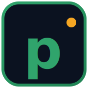

  

<h1 align="center">polycopy</h1>

  <em>Copie automatiquement les meilleurs traders Polymarket sans lever le petit doigt.</em>

  
  
  
  

> [!CAUTION]
> **Bot en phase de test — fortement déconseillé en condition réelle pour le moment.**
>
> Ce code est un prototype personnel. Aucune garantie sur le fonctionnement, la sécurité, la rentabilité ni la conformité juridique. Les bugs peuvent coûter du capital réel. **Reste en `EXECUTION_MODE=dry_run` tant que tu n'as pas lu et compris l'intégralité du code et de la documentation.**
>
> Depuis **M10**, le dry-run est un **miroir fidèle** du live : kill switch actif, alertes Telegram identiques (seul un badge visuel distingue 🟢 `DRY-RUN` de 🔴 `LIVE`), snapshots PnL persistés. Seule la signature CLOB (POST ordre réel) est désactivée. Lis l'[Avertissement](#avertissement) avant tout usage.

---

Documentation complète et claire disponible dès que le developpement sera terminé.

---

## Avertissement

Les marchés prédictifs sont **risqués**. Les performances passées d'un trader ne garantissent rien.

**Polymarket est inaccessible (officiellement) depuis plusieurs juridictions** : États-Unis, France, Royaume-Uni, Singapour, etc. **Vérifie le cadre légal applicable chez toi avant tout usage.** L'auteur de polycopy n'est pas juriste et ne donne aucun conseil juridique.

Ce code est fourni à titre éducatif. **Aucune garantie sur le fonctionnement, la sécurité ou la rentabilité.** Les bugs peuvent coûter du capital réel — toujours commencer en `EXECUTION_MODE=dry_run`, puis avec un `MAX_POSITION_USD` minuscule (≤ $1), et n'augmenter que si tu as observé le bot sur une fenêtre suffisante (≥ 7 jours) sans incident.

Aucun support garanti. Issues GitHub welcome mais réponses best-effort.