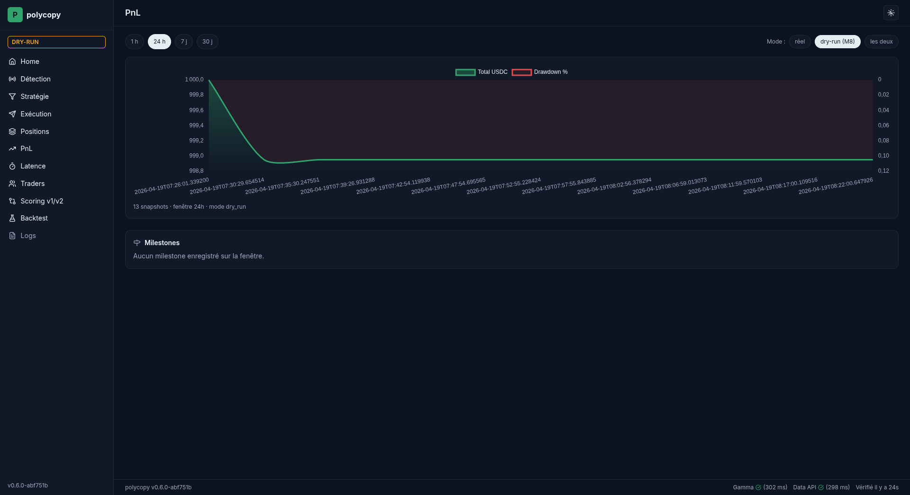
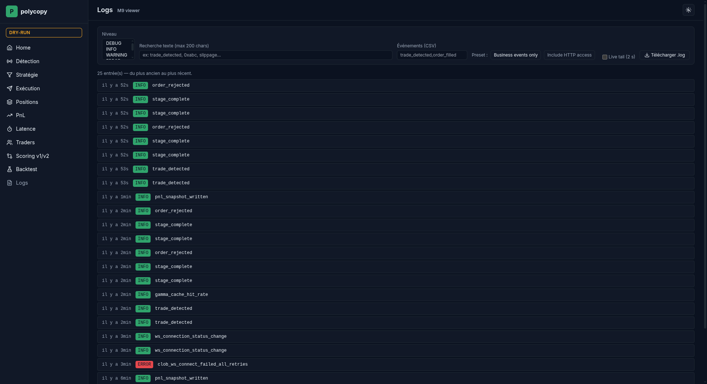
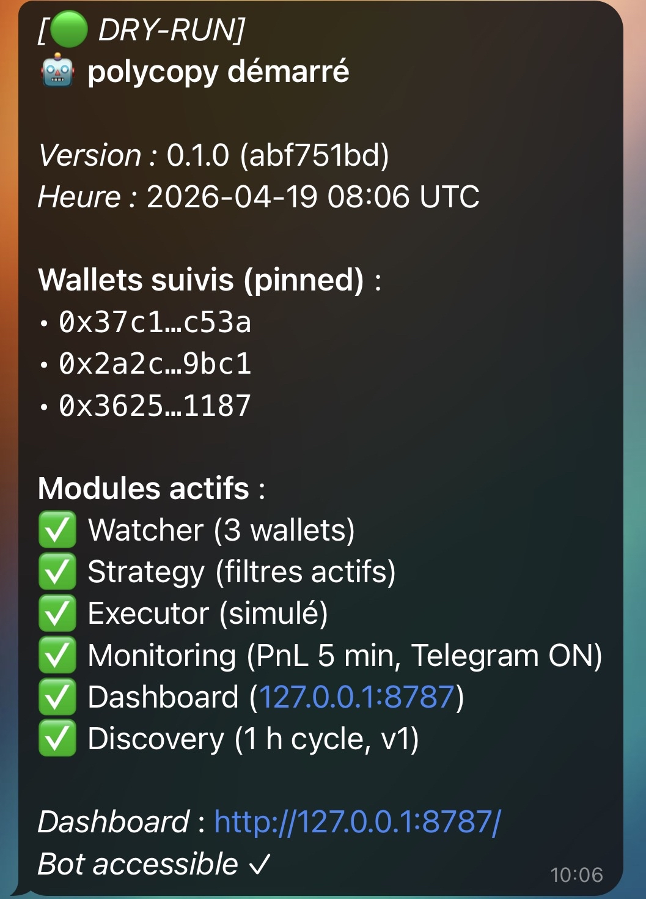
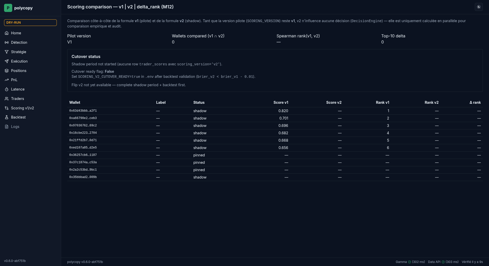
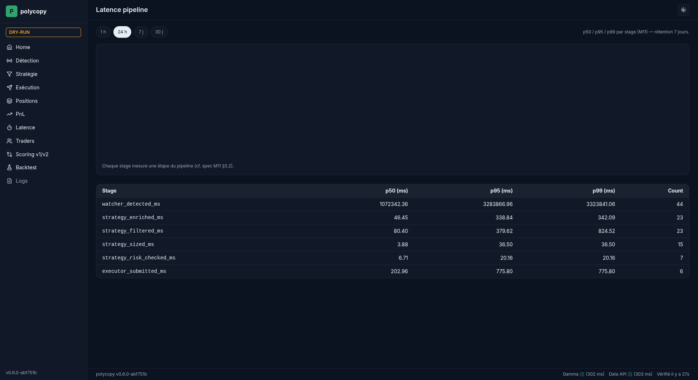

<p align="center">
  
</p>

<h1 align="center">polycopy</h1>

<p align="center">
  <em>Copie automatiquement les meilleurs traders Polymarket sans lever le petit doigt.</em>
</p>

<p align="center">
  
  
  
  
</p>

> [!CAUTION]
> **Bot en phase de test — fortement déconseillé en condition réelle pour le moment.**
>
> Ce code est un prototype personnel. Aucune garantie sur le fonctionnement, la sécurité, la rentabilité ni la conformité juridique. Les bugs peuvent coûter du capital réel. **Reste en `EXECUTION_MODE=dry_run` tant que tu n'as pas lu et compris l'intégralité du code et de la documentation.**
>
> Depuis **M10**, le dry-run est un **miroir fidèle** du live : kill switch actif, alertes Telegram identiques (seul un badge visuel distingue 🟢 `DRY-RUN` de 🔴 `LIVE`), snapshots PnL persistés. Seule la signature CLOB (POST ordre réel) est désactivée. Lis l'[Avertissement](#avertissement) avant tout usage.

---

## Sommaire

- [Quickstart (5 minutes)](#quickstart-5-minutes)
- [Tutorial pas-à-pas](#tutorial-pas-à-pas)
- [Pilote tes bots depuis ton téléphone (M12_bis)](#pilote-tes-bots-depuis-ton-téléphone-m12_bis)
- [FAQ](#faq)
- [Comparaison avec d'autres bots Polymarket](#comparaison-avec-dautres-bots-polymarket)
- [Hall of Fame — wallets publics notables](#hall-of-fame--wallets-publics-notables)
- [Architecture & stack](#architecture--stack)
- [Variables d'environnement](#variables-denvironnement)
- [Going live](#going-live-passage-du-dry-run-au-mode-réel)
- [Roadmap](#roadmap)
- [Avertissement](#avertissement)

---

## Quickstart (5 minutes)

```bash
# 1. Clone
git clone https://github.com/<user>/polycopy ~/code/polycopy && cd ~/code/polycopy

# 2. Setup (idempotent, ~2 min)
bash scripts/setup.sh

# 3. Édite .env avec un wallet à copier (TARGET_WALLETS=0x...).
#    Tu peux piocher une adresse publique depuis un leaderboard de marché sur polymarket.com.

# 4. Lance le bot en mode safe (aucun ordre envoyé)
source .venv/bin/activate
EXECUTION_MODE=dry_run python -m polycopy
```

Après 3-5 secondes, ton terminal affiche un écran statique `rich` avec le nom du bot, un badge de mode coloré (🟢 `DRY-RUN` cyan / 🔴 `LIVE` rouge), la liste des 6 modules actifs, l'URL dashboard et le chemin du fichier log :

<p align="center">
  
</p>

> [!IMPORTANT]
> Le flag CLI `--dry-run` reste accepté par compat (il mappe sur `EXECUTION_MODE=dry_run`). La source de vérité depuis M10 est la variable d'environnement `EXECUTION_MODE` (`simulation` \| `dry_run` \| `live`). `DRY_RUN=true/false` est **déprécié** (lu 1 version avec warning `config_deprecation_dry_run_env`).

Active le dashboard local pour la vue temps réel :

```bash
DASHBOARD_ENABLED=true EXECUTION_MODE=dry_run python -m polycopy
# puis ouvre http://127.0.0.1:8787/
```

<p align="center">
  
</p>

**C'est tout.** Le bot détecte les trades de ton wallet cible et log ce qu'il **ferait**, **sans jamais envoyer d'ordre** — mais **avec** le kill switch actif et les alertes Telegram déclenchées identiques à un run live.

> [!TIP]
> Tu veux pouvoir l'arrêter / le redémarrer depuis ton téléphone, même en 4G hors wifi maison ? Saute à [Pilote tes bots depuis ton téléphone](#pilote-tes-bots-depuis-ton-téléphone-m12_bis) (~30 min de setup, opt-in strict, désactivé par défaut).

---

## Aperçu du dashboard

<table>
  <tr>
    <td width="50%"><a href="assets/screenshots/dashboard-pnl.png"></a><p align="center"><sub><strong>/pnl</strong> — area chart + overlay drawdown + timeline</sub></p></td>
    <td width="50%"><a href="assets/screenshots/dashboard-traders.png"></a><p align="center"><sub><strong>/traders</strong> — scores v1 + jauge SVG + statuts</sub></p></td>
  </tr>
  <tr>
    <td width="50%"><a href="assets/screenshots/dashboard-logs.png"></a><p align="center"><sub><strong>/logs</strong> — filtres level/events + live tail HTMX 2 s (M9)</sub></p></td>
    <td width="50%"><a href="assets/screenshots/telegram-startup.png"></a><p align="center"><sub><strong>Telegram startup</strong> — modules + badge mode (M7 + M10)</sub></p></td>
  </tr>
</table>

Les deux nouveautés visuelles majeures (latence M11, scoring v1 vs v2 M12) sont illustrées plus bas dans [Architecture & stack](#architecture--stack).

---

## Tutorial pas-à-pas

7 étapes pour aller du clone à un bot dry-run instrumenté en 30 minutes. Sections pliables — déroule celle qui t'intéresse.

<details>
<summary><strong>Étape 1 — Installer WSL Ubuntu (si Windows)</strong></summary>

Ce bot tourne dans un environnement Linux natif. Sur Windows, utilise WSL Ubuntu (le sous-système Linux officiel Microsoft).

```powershell
# PowerShell admin :
wsl --install -d Ubuntu
# puis redémarre, lance "Ubuntu" depuis le menu démarrer, crée ton user.
```

Pour la suite, **toujours** travailler depuis le shell WSL bash (`/home/<user>/code/polycopy`), **jamais** depuis `/mnt/c/...` (I/O 10× plus lent sur drvfs).

Sur macOS/Linux : passe à l'étape 2 directement.

</details>

<details>
<summary><strong>Étape 2 — Clone + bootstrap automatique</strong></summary>

Le script `scripts/setup.sh` est **idempotent** (rejouable) et fait : création venv, install deps, copie `.env.example` → `.env`, smoke test.

```bash
git clone https://github.com/<user>/polycopy ~/code/polycopy
cd ~/code/polycopy
bash scripts/setup.sh
```

Sortie attendue (~2 min) :

```
[setup] OK : venv créé
[setup] OK : deps installées
[setup] OK : .env créé depuis .env.example
[setup] OK : smoke test — 1 ligne JSON polycopy_starting affichée
```

Détail des étapes : [docs/setup.md](docs/setup.md).

</details>

<details>
<summary><strong>Étape 3 — Choisir et configurer ton premier wallet à copier</strong></summary>

Ouvre `.env` dans ton éditeur :

```bash
code .env  # ou nano, vim, ...
```

Cherche `TARGET_WALLETS=` et mets 1 ou plusieurs adresses publiques (CSV ou JSON array). Pour démarrer, pioche une adresse depuis un leaderboard de marché sur [polymarket.com](https://polymarket.com) (clique sur un trader, copie son adresse Polygon, 42 caractères commençant par `0x`).

```env
TARGET_WALLETS=0x1234567890abcdef1234567890abcdef12345678
EXECUTION_MODE=dry_run
COPY_RATIO=0.01
MAX_POSITION_USD=1
```

Note : `MAX_POSITION_USD=1` te limite à $1 max par position **même en live**. Garde-fou ceinture-bretelles avant d'oser plus.

</details>

<details>
<summary><strong>Étape 4 — Lancer le bot (CLI silent)</strong></summary>

```bash
source .venv/bin/activate
EXECUTION_MODE=dry_run python -m polycopy
```

Tu vois un écran statique avec les 6 modules actifs (Watcher, Strategy, Executor, Monitoring, Dashboard, Discovery) + le chemin du fichier log + l'URL dashboard si activé.

Les **logs JSON détaillés** vont dans `~/.polycopy/logs/polycopy.log` (rotation `RotatingFileHandler` 10 MB × 10 fichiers, permissions `0o600` sur le fichier et `0o700` sur le répertoire parent — appliquées automatiquement par `cli/logging_config.py`). Pour les lire en live :

```bash
tail -f ~/.polycopy/logs/polycopy.log | jq .
```

Pour restaurer le mode "JSON sur stdout" historique (M1..M8) :

```bash
EXECUTION_MODE=dry_run python -m polycopy --verbose
```

Mode daemon (systemd, nohup, cron) — zéro stdout :

```bash
EXECUTION_MODE=dry_run python -m polycopy --no-cli > /dev/null 2>&1 &
```

> Le fichier log peut contenir wallets publics, condition_ids et timestamps. Rien de sensible en soi mais **ne le partage pas tel quel** — il identifie ta stratégie.

</details>

<details>
<summary><strong>Étape 5 — Activer le dashboard local (optionnel mais recommandé)</strong></summary>

Édite `.env` :

```env
DASHBOARD_ENABLED=true
DASHBOARD_HOST=127.0.0.1   # ⚠️ localhost-only par défaut
DASHBOARD_PORT=8787
```

Relance le bot, puis ouvre `http://127.0.0.1:8787/` :

<p align="center">
  
</p>

Pages disponibles :

- **Home** — KPIs + sparklines SVG inline + dernières détections (auto-refresh HTMX 5 s).
- **Détection / Stratégie / Exécution / Positions** — listes paginées, toutes read-only.
- **PnL** — area chart Chart.js + overlay drawdown + timeline milestones. Toggle dry-run / live (`?mode=dry_run` vs `?mode=real`).

  <p align="center">
    
  </p>

- **Traders** — table avec jauge SVG par score (M5). Scores v1 par défaut, signalés `pinned` pour les wallets venant de `TARGET_WALLETS`.

  <p align="center">
    
  </p>

- **Traders / Scoring** (🆕 **M12**) — comparaison `v1 | v2 | delta_rank` pendant la shadow period, plus Brier agrégé du pool et Spearman rank(v1, v2). Tant que `SCORING_VERSION=v1` (default), seul v1 pilote `DecisionEngine` ; v2 calcule en parallèle pour audit.

  <p align="center">
    
  </p>

- **Latency** (🆕 **M11**) — bar chart p50/p95/p99/count par stage avec filtre `?since=1h|24h|7d|30d`. Les 6 stages instrumentés : `watcher_detected_ms`, `strategy_enriched_ms`, `strategy_filtered_ms`, `strategy_sized_ms`, `strategy_risk_checked_ms`, `executor_submitted_ms`. Cible p95 < 5 s, p99 < 10 s après M11.

  <p align="center">
    
  </p>

- **Logs** — viewer du fichier `polycopy.log` avec filtres level + recherche texte + live tail HTMX (polling 2 s) + bouton télécharger. Depuis **M10**, les `dashboard_request` 2xx/3xx sont exclus par défaut (preset "Business events only" persisté dans `localStorage` clé `polycopy.logs.preset`). Opt-in "Include HTTP access" pour les voir.

  <p align="center">
    
  </p>

- **Backtest** — visualisation du rapport `scripts/score_backtest.py` (M5).

</details>

<details>
<summary><strong>Étape 6 — Activer les alertes Telegram (5 min)</strong></summary>

1. Sur Telegram, cherche `@BotFather` (compte officiel vérifié) → envoie `/newbot`.
2. Choisis un nom (ex: `mon polycopy bot`) puis un username finissant par `bot`.
3. BotFather répond avec un token `123456789:ABC...`.
4. Ouvre la conversation de TON bot, envoie-lui `/start`.
5. Récupère ton chat_id : ouvre `https://api.telegram.org/bot<TON_TOKEN>/getUpdates` dans un navigateur, lis `"chat": {"id": 12345678, ...}`.
6. Édite `.env` :

```env
TELEGRAM_BOT_TOKEN=<ton_token>
TELEGRAM_CHAT_ID=12345678
TELEGRAM_STARTUP_MESSAGE=true
TELEGRAM_HEARTBEAT_ENABLED=true
TELEGRAM_DAILY_SUMMARY=true
TG_DAILY_SUMMARY_HOUR=9
TG_DAILY_SUMMARY_TIMEZONE=Europe/Paris
```

7. Redémarre le bot — tu reçois immédiatement un message de démarrage avec version, modules actifs, lien dashboard.

<p align="center">
  
</p>

<!-- TODO: add telegram-daily-summary.png when available -->

> [!IMPORTANT]
> Depuis **M10**, tous les templates Telegram portent un badge header visuel indiquant le mode d'exécution : 🟢 `SIMULATION` / 🟢 `DRY-RUN` / 🔴 `LIVE`. La **sévérité** des alertes (INFO/WARNING/CRITICAL) est **identique** dans les 3 modes — seul le badge change. Un `kill_switch_triggered` en dry-run est aussi CRITICAL qu'en live, avec la même formulation, parce que le dry-run est un miroir fidèle du live côté observabilité.

Le bot reste **emitter-only** : il ne lit aucune commande entrante. Rotation du token recommandée tous les 6 mois via BotFather `/token`. Détails M7 dans [docs/setup.md §16](docs/setup.md).

</details>

<details>
<summary><strong>Étape 7 — Passer en live (avec checklist sécurité)</strong></summary>

> [!WARNING]
> **Garde le warning du haut en tête.** Le passage en live engage du capital réel. Lis chaque ligne ci-dessous.

Checklist obligatoire :

- [ ] Tu as fait tourner le bot ≥ 7 jours en `EXECUTION_MODE=dry_run` sans crash.
- [ ] Tu as activé `DRY_RUN_REALISTIC_FILL=true` (M8) pour observer le PnL virtuel sur orderbook réel.
- [ ] Tu as observé les `order_filled_large`, `pnl_snapshot_drawdown` et compris ce que le bot ferait. Rappel M10 : ces alertes **tombent aussi en dry-run**, avec le badge 🟢 `DRY-RUN`.
- [ ] Tu as **vérifié la légalité de Polymarket dans ta juridiction** (cf. [FAQ](#faq)).
- [ ] Tu connais le mécanisme du **kill switch** (drawdown ≥ `KILL_SWITCH_DRAWDOWN_PCT`, actif identique dans les 3 modes depuis M10).
- [ ] Tu as activé Telegram pour être alerté en cas de problème.
- [ ] Tu as consulté `/latency` et tes p95 < 5 s (sinon tu rateras des trades rapides, M11).
- [ ] `MAX_POSITION_USD=1` (un dollar) pour ton tout premier run live.

Édite `.env` :

```env
POLYMARKET_PRIVATE_KEY=0x<ta_clé_privée>     # NE COMMIT JAMAIS
POLYMARKET_FUNDER=0x<ton_proxy_address>      # depuis ton profil Polymarket
POLYMARKET_SIGNATURE_TYPE=2                  # 2 = Gnosis Safe (le plus fréquent)
EXECUTION_MODE=live
MAX_POSITION_USD=1
```

Lance :

```bash
python -m polycopy
```

Si une clé manque, le bot **refuse de démarrer** avec un `RuntimeError` clair (4 garde-fous M3 + 1 M8 réaffirmé M10, tous préservés textuellement). Surveille les logs `order_filled` / `order_rejected` ; vérifie chaque transaction sur polymarket.com (onglet "Activity" de ton profil).

</details>

---

## Pilote tes bots depuis ton téléphone (M12_bis)

Tu fais tourner polycopy sur 1 ou plusieurs machines (PC fixe, MacBook, serveur fac…), et tu veux pouvoir l'arrêter, le redémarrer ou consulter son statut depuis ton téléphone — depuis n'importe où, même en 4G hors wifi maison, en moins de 10 secondes. C'est ce que résout **M12_bis** (avril 2026, 6 PRs).

Trois briques empilées, **toutes opt-in** (`REMOTE_CONTROL_ENABLED=false` par défaut, zéro surface ajoutée si tu ne l'actives pas) :

1. **Identité multi-machine** (Phase A) — chaque alerte Telegram porte un badge `🖥️ PC-FIXE` / `💻 MACBOOK` / `🏫 UNI-DEBIAN` pour que tu saches d'où vient le signal en un coup d'œil. Variable : `MACHINE_ID` (fallback `socket.gethostname()`) + `MACHINE_EMOJI`.
2. **API HTTP Tailscale-only + TOTP** (Phases B-D) — 4 routes (`GET /v1/status`, `POST /v1/{stop,resume,restart}`) protégées par 2FA RFC 6238, accessibles **uniquement** depuis ton tailnet privé (bind validé strict CGNAT `100.64.0.0/10`). Auto-lockdown 3-strikes après brute force → touch sentinel + alerte Telegram CRITICAL.
3. **Auto-resurrection sous superviseur** (Phase F) — systemd user unit (Linux/WSL2), launchd LaunchAgent (macOS), Task Scheduler (Windows). Un crash → respawn ≤ 5 s. Un kill switch drawdown -20 % → touch sentinel `halt.flag` → respawn en mode `paused` (Watcher/Strategy/Executor exclus, **zéro nouveau trade**) jusqu'à ce que **tu** valides un `/resume` explicite depuis ton phone.

```
   Téléphone (4G ou wifi)
        │
        │  POST /v1/stop/PC-FIXE  {"totp": "927848"}
        ▼
   Tailscale (CGNAT 100.64.0.0/10, traverse NAT, mesh privé)
        │
        ▼
   Bot polycopy sur PC fixe (WSL2)
        ├─ valide TOTP (±30 s)
        ├─ touch ~/.polycopy/halt.flag  (sentinel, 0o600)
        └─ exit 0  →  systemd respawn  →  mode paused (dashboard reste up)
```

Setup pas-à-pas : [docs/specs/M12_bis_remote_control_setup_guide.md](docs/specs/M12_bis_remote_control_setup_guide.md) — compte ~30-45 min d'install par machine + 10 min tailnet initial. Spec technique complète : [docs/specs/M12_bis_multi_machine_remote_control_spec.md](docs/specs/M12_bis_multi_machine_remote_control_spec.md). Variables d'environnement : voir bloc dédié dans [Variables d'environnement](#variables-denvironnement).

**Garantie sécurité M12_bis** : aucun port public ouvert sur Internet (Tailscale est un mesh chiffré WireGuard), pas de SSH à se rappeler, pas de VPN à activer manuellement. `REMOTE_CONTROL_TOTP_SECRET` ne fuite jamais dans les logs / alertes / repr objets (test de non-régression `test_remote_control_no_secret_leak.py`). Le bind est strictement limité à l'IPv4 Tailscale CGNAT — jamais `0.0.0.0` ni `127.0.0.1` (refusé par validator Pydantic + double-check au boot).

---

## FAQ

<details>
<summary><strong>Est-ce légal dans mon pays ?</strong></summary>

**Polymarket est inaccessible (officiellement) depuis plusieurs juridictions** : États-Unis (interdit aux résidents par CFTC), Royaume-Uni, France, Singapour, Belgique, Australie, Thaïlande, et probablement d'autres (liste **non exhaustive**, susceptible d'évoluer).

Le code de polycopy lui-même est neutre — c'est un script Python qui appelle des APIs publiques. Mais l'utilisation de Polymarket peut violer :

- ta réglementation locale sur les jeux d'argent / paris en ligne,
- la réglementation sur les actifs numériques,
- les conditions d'usage de Polymarket (qui interdit les utilisateurs depuis certaines régions).

**L'auteur de polycopy ne donne aucun conseil juridique. Vérifie avec un juriste avant tout usage en argent réel dans une juridiction sensible.**

</details>

<details>
<summary><strong>C'est quoi la différence entre SIMULATION, DRY_RUN et LIVE ?</strong></summary>

Trois modes introduits par **M10** via `EXECUTION_MODE`. Le dry-run est désormais un **miroir fidèle** du live côté observabilité — seule la signature CLOB (POST ordre réel) est désactivée.

| Comportement | `simulation` | `dry_run` | `live` |
|---|---|---|---|
| Polling Data API (réseau) | Stub fixtures locales | ✅ Actif | ✅ Actif |
| Lookup Gamma + CLOB midpoint | Stub | ✅ Actif | ✅ Actif |
| POST ordre CLOB signé | ❌ (client pas instancié) | ❌ (client pas instancié) | ✅ (`create_and_post_order`) |
| Realistic fill M8 (`/book`) | ❌ | ✅ si `DRY_RUN_REALISTIC_FILL=true` | ❌ |
| `PnlSnapshotWriter` en DB | ✅ in-memory / tmp | ✅ SQLite `is_dry_run=true` | ✅ SQLite `is_dry_run=false` |
| Kill switch `stop_event.set()` | ✅ local au run | ✅ **identique LIVE** | ✅ |
| Alerte `kill_switch_triggered` | CRITICAL loggée | **CRITICAL Telegram** 🟢 `DRY-RUN` | CRITICAL Telegram 🔴 `LIVE` |
| Alerte `order_filled_large` | N/A | INFO Telegram 🟢 `DRY-RUN` | INFO Telegram 🔴 `LIVE` |
| Creds CLOB L1/L2 consommées | ❌ | ❌ | ✅ |

Le but de cette parité : un utilisateur qui observe 3 jours de dry-run doit voir se déclencher **exactement** ce qui se déclencherait en live. Sinon le dry-run n'a aucune valeur prédictive.

Pour désactiver explicitement le kill switch sur un long backtest (sans toucher au code) : `KILL_SWITCH_DRAWDOWN_PCT=100`.

</details>

<details>
<summary><strong>Combien je dois mettre au départ ?</strong></summary>

**Minimum pour un test live** : $5 en USDC sur ton proxy wallet Polymarket, avec `MAX_POSITION_USD=1`. Laisse tourner 1-2 semaines, regarde le dashboard `/pnl`. Si tu es satisfait, augmente par paliers : `$5 → $20 → $100 → ...`. Ne dépasse jamais ce que tu peux perdre **en intégralité, du jour au lendemain**.

Avant tout live, fais tourner ≥ 7 jours en `EXECUTION_MODE=dry_run` avec `DRY_RUN_REALISTIC_FILL=true` (M8) pour observer le PnL virtuel sur orderbook réel. Depuis M10, le kill switch s'active aussi pendant ces runs — si tu le vois se déclencher en dry-run, ça se déclencherait en live.

</details>

<details>
<summary><strong>Comment je sais que le bot tourne bien ?</strong></summary>

3 signaux indépendants :

1. **Dashboard** : `http://127.0.0.1:8787/healthz` répond `200 {"status":"ok"}`.
2. **Telegram heartbeat** (si activé en M7) : tu reçois un "💚 polycopy actif" toutes les 12 h.
3. **Logs** : `tail -f ~/.polycopy/logs/polycopy.log | jq .event` fait défiler des events.

Si l'un des 3 stoppe : process probablement mort.

</details>

<details>
<summary><strong>Comment je pilote le bot quand je suis en déplacement ?</strong></summary>

Depuis **M12_bis** : Tailscale + TOTP + supervisor = tu pilotes depuis ton téléphone via 4 raccourcis iOS Shortcuts ou Android HTTP Shortcuts (`status` / `stop` / `resume` / `restart`). Pas de port public ouvert sur Internet, pas de SSH à se rappeler, pas de VPN manuel — Tailscale est un mesh privé WireGuard qui traverse les NATs.

`REMOTE_CONTROL_ENABLED=false` par défaut (zéro surface ajoutée). Si tu actives, le bind est strictement limité à l'IP Tailscale CGNAT (`100.64.0.0/10`) — jamais `0.0.0.0` ni `127.0.0.1`, refusé 2× par validator Pydantic et par re-check au boot. TOTP RFC 6238 base32, fenêtre ±30 s, lockdown auto après 3 fails (touch sentinel + alerte Telegram CRITICAL).

Pour la chaîne complète et le smoke test depuis 4G hors wifi : section dédiée [Pilote tes bots depuis ton téléphone](#pilote-tes-bots-depuis-ton-téléphone-m12_bis) + [setup guide](docs/specs/M12_bis_remote_control_setup_guide.md).

</details>

<details>
<summary><strong>Que faire si mon PnL plonge ?</strong></summary>

- Si `drawdown ≥ KILL_SWITCH_DRAWDOWN_PCT=20%`, le bot **se coupe automatiquement** (dans les **3 modes** SIMULATION/DRY_RUN/LIVE depuis M10) + alerte Telegram CRITICAL avec badge visuel du mode (`🟢 DRY-RUN` ou `🔴 LIVE`).
- Sinon, options manuelles :
  1. Bascule `EXECUTION_MODE=dry_run` + redémarre → continue d'observer sans risque.
  2. Baisse `MAX_POSITION_USD` (par 2 minimum).
  3. Désactive le wallet sous-performant : `sqlite3 polycopy.db "UPDATE target_traders SET active=0 WHERE wallet_address='0x...';"`.

> **M10 — dry-run = miroir fidèle live.** Le comportement observé en dry-run reflète exactement ce que ferait le bot en live (alertes, drawdown, `stop_event`). Seule la signature CLOB (POST ordre réel) est désactivée. Pour désactiver explicitement le kill switch sur un backtest long : `KILL_SWITCH_DRAWDOWN_PCT=100`.

</details>

<details>
<summary><strong>Comment savoir si ma latence est bonne ?</strong></summary>

Depuis **M11**, chaque trade copié porte un `trade_id` (uuid hex) bindé en contextvar `structlog` et propagé via 6 stages instrumentés avec `time.perf_counter_ns`. Les durées sont persistées dans la table append-only `trade_latency_samples` (purge 7 j) et rendues sur `/latency` en p50/p95/p99 par stage, avec filtre `?since=`.

Cibles post-M11 :

- **p95 < 5 s** end-to-end (watcher → executor).
- **p99 < 10 s**.
- `gamma_cache_hit_rate > 70 %` (grep le fichier log).
- `ws_connection_status_change < 3` transitions / heure (WS CLOB stable).

Si p95 > 10 s après 1 h d'observation, regarde quel stage domine — le plus fréquent est `watcher_detected_ms` (rattrapage historique au boot, normal) ou `strategy_enriched_ms` (Gamma miss). Pour désactiver l'instrumentation en cas de surcharge CPU : `LATENCY_INSTRUMENTATION_ENABLED=false`. Pour revenir au comportement M2..M10 strict (HTTP `/midpoint` sans WS, TTL Gamma 60 s uniforme) : `STRATEGY_CLOB_WS_ENABLED=false` et `STRATEGY_GAMMA_ADAPTIVE_CACHE_ENABLED=false`.

</details>

<details>
<summary><strong>Quand bascule-t-on du scoring v1 au v2 ?</strong></summary>

**Jamais automatiquement.** `SCORING_VERSION=v1` est le default et le reste tant que **tu** ne le changes pas manuellement.

Déroulé M12 :

1. **Shadow period** (14 j par défaut via `SCORING_V2_SHADOW_DAYS`) : v1 pilote `DecisionEngine` (promote/demote/keep), v2 calcule en parallèle et écrit `trader_scores` avec `scoring_version="v2"` pour audit. Dashboard `/traders/scoring` te montre `v1 | v2 | delta_rank`.
2. **Backtest obligatoire** : lance `scripts/backtest_scoring_v2.py` sur le set labelé `assets/scoring_v2_labels.csv` (≥ 50 wallets). Tu veux voir **`brier_top10_v2 < brier_top10_v1 - 0.01`** — sinon v2 n'apporte rien de significatif.
3. **Cutover manuel** : si et seulement si le backtest passe, tu mets `SCORING_VERSION=v2` dans `.env` (et optionnellement `SCORING_V2_CUTOVER_READY=true` pour activer le bouton dashboard).
4. **Versioning sacré** : chaque row `trader_scores` porte sa `scoring_version` — **aucun rewrite rétroactif** n'est fait. L'audit trail est préservé.

La formule v2 est pondérée **en code** (fixe) : `0.25·risk_adjusted + 0.20·calibration + 0.20·timing_alpha + 0.15·specialization + 0.10·consistency + 0.10·discipline`. Changer une pondération = bumper `SCORING_VERSION` vers `"v2.1"` (ajouter une entrée dans `SCORING_VERSIONS_REGISTRY`), **jamais** patcher les coefficients en place.

6 gates durs pré-scoring s'appliquent uniquement en v2 : `cash_pnl_90d>0`, `trade_count_90d≥50`, `days_active≥30`, `zombie_ratio<0.40`, `not blacklisted`, `not in WASH_CLUSTER_WALLETS`. Un wallet rejeté écrit `trader_events.event_type="gate_rejected"` avec une raison explicite, et n'est **jamais** scoré (économie compute + pool plus propre).

</details>

<details>
<summary><strong>Quelle est la stack ? Pourquoi Python + SQLite ?</strong></summary>

- **Python 3.11+** (asyncio, TaskGroup) — readable, batteries included.
- `py-clob-client` (SDK officiel Polymarket pour signature CLOB).
- `httpx` async + `tenacity` retry + `websockets` (M11, channel `market` read-only).
- **SQLAlchemy 2.0** + `aiosqlite` — single-process, pas de besoin Postgres pour 1 user.
- `Pydantic v2` pour la config + DTOs.
- `structlog` JSON routé via `stdlib.LoggerFactory` (M9).
- FastAPI + HTMX + Tailwind CDN + Chart.js pour le dashboard (zéro `node_modules`).
- `rich` pour le CLI silent (M9).
- `Jinja2` pour les templates Telegram MarkdownV2 (M7), surchargeables via `assets/telegram/*.md.j2`.

Migration Postgres triviale : change `DATABASE_URL` en `postgresql+asyncpg://...`. `alembic upgrade head` tourne au boot, auto-stamp baseline si DB M3 préexistante.

</details>

<details>
<summary><strong>Quels sont les coûts cachés (gas, fees, slippage) ?</strong></summary>

- **Gas Polygon** : payé par le proxy wallet en MATIC, ~$0.001 par tx. À financer **avant** ton premier ordre.
- **Trading fees Polymarket** : 0 % maker, ~0 % taker (au moment de la rédaction — vérifie sur leur site ; M13 ajoutera un fetch dynamique via `GET /fee-rate?tokenID=`).
- **Slippage** : limité par `MAX_SLIPPAGE_PCT=2.0` côté bot. Peut rejeter des ordres si le marché bouge entre détection et envoi.
- **Latence** : ~2-3 s détection → exécution post-M11 (WS CLOB + cache Gamma adaptatif), ~10-15 s pré-M11. Toujours insuffisant pour les marchés ultra-réactifs (news live) mais acceptable pour le "smart money following" où l'edge dure des minutes.

</details>

<details>
<summary><strong>Bot vs trading manuel : quel intérêt ?</strong></summary>

Avantages bot :

- Suit 24/7 sans burn-out.
- Discipline du sizing (jamais de FOMO).
- Audit complet (chaque décision est loggée + dashboard).
- Backtest possible (`scripts/score_backtest.py`, `scripts/backtest_scoring_v2.py`).

Inconvénients :

- Latence 2-3 s post-M11 vs ~1 s humain ultra-réactif sur news.
- Pas de **discrétion contextuelle** (le bot copie même les trades absurdes si le wallet cible n'est pas filtré).
- **Bug = perte réelle**. L'humain a au moins l'intuition de ne pas appuyer sur "OK" si quelque chose semble louche.

Le bon usage : bot pour les wallets que tu ne pourrais pas suivre toi-même, manuel pour tes convictions personnelles.

</details>

<details>
<summary><strong>Où signaler un bug / proposer une amélioration ?</strong></summary>

GitHub issues sur ce repo. PR welcome après discussion sur l'issue. Conventions : voir [CLAUDE.md](CLAUDE.md) (conventions internes) + commits `feat(...)` / `fix(...)` / `docs(...)`.

</details>

---

## Comparaison avec d'autres bots Polymarket

Concurrents retenus à partir des sources citées dans [docs/development/](docs/development/) (synthèse [`M10_synthesis_reference.md`](docs/development/M10_synthesis_reference.md), deep-searches Gemini + Perplexity du 2026-04-18). Trois positionnements très différents : bot SaaS Telegram fermé (KreoPoly), outil smart-money SaaS fermé (PolyHub / Hubble), framework algo trading institutionnel open-source (NautilusTrader).

| Critère | **polycopy** | [KreoPoly](https://kreopoly.app)<sup>1</sup> | [PolyHub (Hubble)](https://www.mexc.com/news/765626)<sup>2</sup> | [NautilusTrader](https://nautilustrader.io/docs/latest/integrations/polymarket/)<sup>3</sup> |
|---|---|---|---|---|
| Open-source | ✅ MIT | ❌ closed source (SaaS Telegram) | ❌ closed source (SaaS) | ✅ LGPL-3.0 |
| Langage | Python 3.11 | non divulgué | non divulgué | Rust + bindings Python |
| Self-hosted (tu contrôles tes clés) | ✅ | ❌ bot centralisé | ❌ bot centralisé | ✅ |
| Copy trading wallets | ✅ M1+M5 (scoring auto) | ✅ mirror top wallets Polymarket + Kalshi | ✅ smart money filter | ⚠️ framework générique, logique à implémenter |
| Filtrage par catégorie Gamma | ✅ M12 (HHI `specialization`) | ✅ politique / culture / sport / macro | ⚠️ non documenté | — |
| Scoring anti-zombie + Brier + Sortino | ✅ **M12** (6 facteurs + 6 gates durs + shadow period) | ❌ (win rate + ROI + fréquence) | ❌ (PnL + ROI + fréquence + timing optionnel) | ❌ (à la charge de l'intégrateur) |
| Dry-run = miroir fidèle live | ✅ **M10** (kill switch + alertes identiques) | ⚠️ non documenté | ⚠️ non documenté | ✅ (backtesting engine natif) |
| WebSocket CLOB (latence < 5 s p95) | ✅ **M11** (channel `market` + fallback HTTP transparent) | ⚠️ non documenté | ⚠️ non documenté | ✅ (pipelines vectorisés) |
| Dashboard local | ✅ FastAPI + HTMX read-only (M4.5 + M6) | ❌ (Telegram uniquement) | ⚠️ interface web hébergée | ⚠️ monitoring externe à brancher |
| Alertes Telegram enrichies | ✅ M7 (15 templates Jinja2, digest, daily, heartbeat, badges mode M10) | ✅ natif Telegram | ❌ | ❌ |
| CLI silent + log file rotation | ✅ M9 | — | — | ⚠️ logs framework génériques |
| Coût | gratuit (self-hosted) | freemium + SaaS | freemium + SaaS | gratuit (LGPL) |
| Dernière maj consultée | 2026-04 | 2026-03 | 2026 | 2026-04 |

<sup>1</sup> **KreoPoly** — [kreopoly.app](https://kreopoly.app). Sources Medium : [Gaining the Edge: How Kreo is Revolutionizing Prediction Market Trading](https://medium.com/@fxmbrand/gaining-the-edge-how-kreo-is-revolutionizing-prediction-market-trading-96aa3731edb4), [Kreo Polymarket Telegram Bot: Copy Trading Polymarket and Kalshi](https://medium.com/@gemQueenx/kreo-polymarket-telegram-bot-copy-trading-polymarket-and-kalshi-cdde3563307a). Mention MEXC [Smart Money Copy Trading Guide](https://www.mexc.com/news/988541). Synthèse interne [`M10_synthesis_reference.md`](docs/development/M10_synthesis_reference.md) §1.1 + §6.3 : ranking metrics convergents avec v1, pas d'API publique, "ne pas essayer de scraper — fragilité".

<sup>2</sup> **PolyHub (Hubble)** — présenté dans [Polymarket Advanced: How to Build Your Smart Money Address](https://www.mexc.com/news/765626). Analyse Perplexity DeepResearch §1.1 : filtre les wallets par PnL / ROI / fréquence de trading sur fenêtre 30 j avec timing score optionnel.

<sup>3</sup> **NautilusTrader** — [nautilustrader.io](https://nautilustrader.io/docs/latest/integrations/polymarket/), intégration Polymarket officielle. Référencé dans la Gemini DeepResearch §4 comme benchmark latence HFT-grade (cf. [gemini_deep_search_v2_and_more.md](docs/development/gemini_deep_search_v2_and_more.md)). Framework institutionnel — positionnement très différent : tu codes ta stratégie par-dessus, il ne vient pas avec un copy-trading clé-en-main.

**Liste non exhaustive** et datée (2026-04-18). Des outils comme l'[Apify Polymarket Leaderboard Scraper](https://apify.com/saswave/polymarket-leaderboard-scraper) (référencé Gemini §1.1) sont des *data sources*, pas des bots, donc hors comparaison. PR welcome pour corriger / ajouter un concurrent **avec source vérifiable dans `docs/development/`**.

---

## Hall of Fame — wallets publics notables

> [!IMPORTANT]
> **Aucune adresse hardcodée tant qu'elle n'a pas été vérifiée.** Les anciennes versions de ce README listaient des placeholders `0x1111…1111` / `0x2222…2222` qui pouvaient induire en erreur (risque qu'un lecteur copie littéralement une adresse bidon dans `.env`). La bonne approche est data-driven : **génère ton propre Hall of Fame** à partir des données Polymarket publiques.

### Option 1 — Backtest sur seed public

Le fichier [`docs/specs/m5_backtest_seed.txt`](docs/specs/m5_backtest_seed.txt) contient **~50 vraies adresses publiques** documentées, prêtes à passer dans le scoring v1. Génère un rapport HTML classé par corrélation score ↔ ROI observé :

```bash
source .venv/bin/activate
python scripts/score_backtest.py \
  --wallets-file docs/specs/m5_backtest_seed.txt \
  --as-of 2026-01-15 \
  --observe-days 30 \
  --output backtest_v1_report.html
```

Ouvre `backtest_v1_report.html`. Si Spearman score ↔ ROI ≥ 0.30 sur ≥ 50 wallets, la formule v1 est validée et tu peux activer M5 en prod (cf. [docs/setup.md §14](docs/setup.md)).

### Option 2 — Discovery live via `/traders/scoring`

Active la découverte automatique :

```env
DISCOVERY_ENABLED=true
SCORING_VERSION=v1
MAX_ACTIVE_TRADERS=10
TRADER_SHADOW_DAYS=7
```

Relance le bot. À chaque cycle (6 h par défaut), M5 bootstrap un pool de 100 candidats via `/holders` top-liquidité + `/trades` filtré. Les meilleurs passent `shadow` → `active` après observation. Consulte l'onglet [`/traders`](http://127.0.0.1:8787/traders) du dashboard (scores v1) ou [`/traders/scoring`](http://127.0.0.1:8787/traders/scoring) (comparaison v1 vs v2 post-M12).

### Option 3 — Validation scoring v2 (post-M12)

Si tu as activé le mode shadow v1/v2 et tu veux voir quels wallets survivent aux 6 gates durs :

```bash
python scripts/backtest_scoring_v2.py \
  --label-file assets/scoring_v2_labels.csv \
  --output backtest_v2_report.html
```

Tu vérifies que `brier_top10_v2 < brier_top10_v1 - 0.01` avant de flipper `SCORING_VERSION=v2`.

**Aucune recommandation personnelle**. Un wallet qui performe sur 90 j peut perdre son edge au cycle suivant — le scoring v1 (et a fortiori v2) est une heuristique, pas une prédiction.

---

## Architecture & stack

5 couches asynchrones faiblement couplées + 2 modules optionnels (Dashboard, Discovery) + 1 couche présentation (CLI/Logging M9).

```
     [Data API]   [Gamma API]   [CLOB HTTP + WS market]
           \          |          /
            v         v         v
          Watcher ──> Storage (SQLite + Alembic)
                        |
                        v
                 Strategy Engine (4 filtres)
                 ├─ ClobMarketWSClient (M11, cache mid-price)
                 └─ _cache_policy.compute_ttl (M11, TTL Gamma adaptatif)
                        |
                        v
                    Executor ──> Polymarket CLOB (L1+L2 signé, live uniquement)
                        |              |
                        v              v
                 Position Tracker   Polygon settlement
                        |
                        v
                 Monitoring (logs, Telegram badges mode M10, kill switch 3 modes)
                        |
                        v
                 Dashboard FastAPI read-only (/home /pnl /traders /traders/scoring M12 /latency M11 /logs M9)

    Discovery (M5) ──> scoring/v1.py              (formule M5 consistency+roi+div+vol)
                   └─ scoring/v2/                 (M12, isolé, opt-in via SCORING_VERSION)
                       ├─ factors/               (6 facteurs purs)
                       ├─ gates.py               (6 gates durs pré-scoring)
                       ├─ normalization.py       (winsorisation p5-p95 pool-wide)
                       ├─ aggregator.py          (pondération fixe 0.25/0.20/0.20/0.15/0.10/0.10)
                       └─ category_resolver.py   (Gamma ?include_tag=true)
```

### Latence M11 — pipeline temps réel phase 1

Trois leviers additifs, tous derrière feature flags `true` par défaut :

- **`ClobMarketWSClient`** consomme **exclusivement** le channel `market` (read-only public, aucune auth L1/L2, aucune signature, aucune creds touchée). Sub/unsub lazy sur les `token_id` candidats, cache in-memory mid-price, unsub après 5 min d'inactivité, health check 30 s, reconnect `tenacity` (max 10 retries backoff exponentiel), cap LRU 500 tokens anti-leak. `SlippageChecker` lookup le cache d'abord, fallback HTTP `/midpoint` **transparent** si WS down ou `STRATEGY_CLOB_WS_ENABLED=false`.
- **Cache Gamma adaptatif** via `_cache_policy.compute_ttl(market, now)` : TTL 0 pour marché résolu, 10 s proche résolution, 300 s actif, 3600 s inactif. Remplace le TTL 60 s uniforme M2 (hit rate ~50 % → ~85 %).
- **Instrumentation 6 stages** : `trade_id` uuid hex généré par `WalletPoller`, bindé en contextvar `structlog`, propagé via DTOs. 6 durées mesurées avec `time.perf_counter_ns`, persistées append-only dans `trade_latency_samples` (migration 0005, purge 7 j via `LatencyPurgeScheduler` au boot + quotidien).

Cible **2-3 s** end-to-end vs ~10-15 s pré-M11. Dashboard `/latency` p50/p95/p99 par stage avec filtre `?since=` :

<p align="center">
  
</p>

### Scoring M12 — formule hybride + gates durs

Sous-package isolé [`src/polycopy/discovery/scoring/v2/`](src/polycopy/discovery/scoring/v2/) — **zéro ligne modifiée** dans `scoring/v1.py`, `decision_engine.py` ou le lifecycle M5. Opt-in strict via `SCORING_VERSION=v2` après validation backtest.

**Formule hybride 6 facteurs**, pure functions testables isolément, pondération figée en code :

```
Score_v2 = 0.25 · risk_adjusted    (Sortino 90d + Calmar 90d)
         + 0.20 · calibration       (Brier-skill vs pool baseline)
         + 0.20 · timing_alpha      (pair→wallet, neutre v1, Mitts-Ofir v2.1)
         + 0.15 · specialization    (HHI catégories Gamma ?include_tag=true)
         + 0.10 · consistency       (fraction mois avec PnL > 0)
         + 0.10 · discipline        ((1 − zombie_ratio) × sizing_stability)
```

**6 gates durs pré-scoring**, fail-fast dans `gates.py`, wallet rejeté → `trader_events.event_type="gate_rejected"`, **jamais** scoré :

1. `cash_pnl_90d > 0`
2. `trade_count_90d ≥ 50` (relâché à 20 si `SCORING_V2_COLD_START_MODE=true`)
3. `days_active ≥ 30`
4. `zombie_ratio < 0.40` (positions avec `current_value < 0.02 × initial_value`)
5. `wallet not in BLACKLISTED_WALLETS`
6. `wallet not in WASH_CLUSTER_WALLETS`

**Shadow period** : `SCORING_VERSION=v1` (default) + `SCORING_V2_SHADOW_DAYS=14` → v1 pilote `DecisionEngine`, v2 dual-écrit `trader_scores` (audit). Cutover humain **manuel** conditionné au rapport `scripts/backtest_scoring_v2.py` (cible `brier_top10_v2 < brier_top10_v1 - 0.01` sur `assets/scoring_v2_labels.csv`). Le dashboard `/traders/scoring` rend la comparaison côte-à-côte :

<p align="center">
  
</p>

**Versioning sacré** : chaque row `trader_scores` porte sa `scoring_version`, pas de rewrite rétroactif. Changer une pondération = bumper `"v2.1"`, pas patcher en place. La table n'est jamais purgée.

Prérequis `TraderDailyPnl` : table append-only (migration 0006) peuplée toutes les 24 h par `TraderDailyPnlWriter` co-lancé dans `DiscoveryOrchestrator`. Source unique Sortino/Calmar/consistency. Contient uniquement `wallet_address` publique + `equity_usdc` + `date` — aucun secret, aucun PII.

### M12_bis — multi-machine + remote control

Side-car opt-in (`REMOTE_CONTROL_ENABLED=false` par défaut), strictement additif aux 5 couches existantes. Aucune ligne modifiée dans les chemins live M3 / kill switch M4 / dry-run M8.

- [`src/polycopy/remote_control/`](src/polycopy/remote_control/) — package isolé : `tailscale.py` (résolution `tailscale ip -4` + validator CGNAT), `auth.py` (`TOTPGuard` pyotp + `RateLimiter` deque + `AutoLockdown` 3-strikes), `sentinel.py` (`SentinelFile` `~/.polycopy/halt.flag` 0o600/0o700), `server.py` (FastAPI 4 routes `GET /v1/health`, `GET /v1/status/<machine>`, `POST /v1/{restart,stop,resume}/<machine>`), `orchestrator.py` (uvicorn bind Tailscale exclusif).
- **Bifurcation `cli/boot.py::build_orchestrators(mode)`** : au boot, lecture du sentinel `halt.flag`. Si présent → mode `paused` (Monitoring + Dashboard + RemoteControl uniquement, **Watcher/Strategy/Executor exclus** = zéro nouveau trade). Si absent → mode `normal` (stack complet). Seul un `POST /v1/resume` (TOTP humain) clear le sentinel et déclenche un respawn en mode normal.
- **Ordre sacré du kill switch** : `PnlSnapshotWriter` détecte drawdown ≥ 20 % → `touch sentinel` puis `stop_event.set()` (ordre inverse = respawn unsafe en mode normal malgré drawdown).
- **Identité multi-machine** : injection `machine_id` + `machine_emoji` en 2ᵉ ligne de chaque alerte Telegram via [alert_renderer.py:146-170](src/polycopy/monitoring/alert_renderer.py#L146-L170) — pattern strict copy-paste du `mode_badge` M10. Public, non-sensible, loggé en clair au boot via event `machine_id_resolved`.
- **Auto-resurrection** : superviseurs déclaratifs `Restart=always` (systemd) / `KeepAlive=true` (launchd) / Task Scheduler logon trigger (Windows). Tous les artefacts dans [scripts/supervisor/{systemd,launchd,windows}/](scripts/supervisor/).

Pitch & setup utilisateur : section [Pilote tes bots depuis ton téléphone](#pilote-tes-bots-depuis-ton-téléphone-m12_bis). Spec technique : [docs/specs/M12_bis_multi_machine_remote_control_spec.md](docs/specs/M12_bis_multi_machine_remote_control_spec.md). ADR : [docs/specs/idea2_remote_control_decision.md](docs/specs/idea2_remote_control_decision.md).

Règle de dépendance : `watcher` → `storage`, `strategy` → `storage`, `executor` → `storage`. Aucun module ne dépend d'un autre module fonctionnel directement, tout passe par la DB ou par des events asyncio. Le `__main__` orchestre.

Détail technique : [docs/architecture.md](docs/architecture.md). Conventions de code : [CLAUDE.md](CLAUDE.md). Specs par milestone : [docs/specs/](docs/specs/).

---

## Variables d'environnement

Table complète générée depuis [`.env.example`](.env.example). Les variables non listées ici ne sont jamais lues. Le bot crashe au boot avec un message clair si une variable requise manque.

<details>
<summary><strong>Wallet Polymarket (requis en live)</strong></summary>

| Variable | Description | Default | Requis |
|---|---|---|---|
| `POLYMARKET_PRIVATE_KEY` | Clé privée du wallet de signature. **Jamais committer.** | — | **si `EXECUTION_MODE=live`** |
| `POLYMARKET_FUNDER` | Adresse du proxy wallet qui détient les fonds (visible dans le profil Polymarket). | — | **si `EXECUTION_MODE=live`** |
| `POLYMARKET_SIGNATURE_TYPE` | `0` EOA standalone · `1` Email/Magic (compte Polymarket.com) · `2` Gnosis Safe / browser wallet proxy (le plus fréquent). | `1` | non |

</details>

<details>
<summary><strong>Cibles, sizing, risque</strong></summary>

| Variable | Description | Default | Requis |
|---|---|---|---|
| `TARGET_WALLETS` | Wallets à copier, CSV ou JSON array. | — | **toujours** |
| `COPY_RATIO` | Fraction du trade source à répliquer. | `0.01` | non |
| `MAX_POSITION_USD` | Plafond par position. | `100` | non |
| `MIN_MARKET_LIQUIDITY_USD` | Liquidité CLOB minimum pour `MarketFilter`. | `5000` | non |
| `MIN_HOURS_TO_EXPIRY` | Skip marchés trop proches de l'expiration. | `24` | non |
| `MAX_SLIPPAGE_PCT` | Slippage max vs prix source. | `2.0` | non |
| `KILL_SWITCH_DRAWDOWN_PCT` | Stop tout si drawdown > X %. Actif dans les 3 modes depuis M10. | `20` | non |
| `RISK_AVAILABLE_CAPITAL_USD_STUB` | Capital dispo stub M2, remplacé par lecture wallet on-chain à M3. | `1000.0` | non |
| `POLL_INTERVAL_SECONDS` | Fréquence de polling Data API. | `5` | non |
| `DATABASE_URL` | URL DB SQLAlchemy async. Postgres trivial (`postgresql+asyncpg://...`). | `sqlite+aiosqlite:///polycopy.db` | non |

</details>

<details>
<summary><strong>Modes d'exécution (M10)</strong></summary>

| Variable | Description | Default | Requis |
|---|---|---|---|
| `EXECUTION_MODE` | `simulation` · `dry_run` · `live`. Remplace `DRY_RUN` depuis M10. Voir [FAQ](#faq) pour le tableau comportemental. | `dry_run` | non |
| `DRY_RUN` | **[DEPRECATED M10]** Legacy `true/false` lu 1 version avec warning `config_deprecation_dry_run_env`. Supprimé à version+2. **Préférer `EXECUTION_MODE`.** | — | non |

</details>

<details>
<summary><strong>Dry-run réaliste (M8)</strong></summary>

| Variable | Description | Default | Requis |
|---|---|---|---|
| `DRY_RUN_REALISTIC_FILL` | Simule chaque FOK sur la profondeur orderbook réelle via `/book` read-only. Actif uniquement si `EXECUTION_MODE=dry_run` (ignoré en SIMULATION/LIVE). | `false` | non |
| `DRY_RUN_VIRTUAL_CAPITAL_USD` | Capital initial virtuel pour le PnL dry-run (snapshots `is_dry_run=true`). Ne pilote pas le RiskManager. | `1000` | non |
| `DRY_RUN_BOOK_CACHE_TTL_SECONDS` | TTL cache in-memory `/book` par asset_id. | `5` | non |
| `DRY_RUN_RESOLUTION_POLL_MINUTES` | Cadence `DryRunResolutionWatcher` (close virtuels Gamma). | `30` | non |
| `DRY_RUN_ALLOW_PARTIAL_BOOK` | `false` = FOK strict cohérent live. `true` = autorise fill partiel (s'écarte du live). | `false` | non |

</details>

<details>
<summary><strong>Monitoring & alertes Telegram (M4 + M7)</strong></summary>

| Variable | Description | Default | Requis |
|---|---|---|---|
| `TELEGRAM_BOT_TOKEN` | Token BotFather. Bypass silencieux si vide. Rotation 6 mois. | — | non |
| `TELEGRAM_CHAT_ID` | Chat ID où envoyer les messages. | — | non |
| `PNL_SNAPSHOT_INTERVAL_SECONDS` | Période entre 2 snapshots PnL. | `300` | non |
| `ALERT_LARGE_ORDER_USD_THRESHOLD` | Seuil USD pour `order_filled_large`. | `50.0` | non |
| `ALERT_COOLDOWN_SECONDS` | Anti-spam Telegram par event_type (in-memory, reset au boot). | `60` | non |
| `TELEGRAM_STARTUP_MESSAGE` | Message de démarrage au boot (version, modules, dashboard). No-op si pas de token. | `true` | non |
| `TELEGRAM_HEARTBEAT_ENABLED` | Heartbeat périodique "💚 polycopy actif". | `false` | non |
| `TELEGRAM_HEARTBEAT_INTERVAL_HOURS` | Intervalle heartbeat (1–168 h). | `12` | non |
| `TELEGRAM_DAILY_SUMMARY` | Résumé quotidien (trades 24 h, décisions, ordres, PnL, discovery, alertes). | `false` | non |
| `TG_DAILY_SUMMARY_HOUR` | Heure locale d'envoi (0–23). | `9` | non |
| `TG_DAILY_SUMMARY_TIMEZONE` | TZ IANA validée via `zoneinfo.ZoneInfo` au boot. | `Europe/Paris` | non |
| `TELEGRAM_DIGEST_THRESHOLD` | ≥ N alertes du même event_type → batch digest. | `5` | non |
| `TELEGRAM_DIGEST_WINDOW_MINUTES` | Fenêtre glissante de comptage digest. | `60` | non |

</details>

<details>
<summary><strong>Pipeline temps réel (M11)</strong></summary>

| Variable | Description | Default | Requis |
|---|---|---|---|
| `STRATEGY_CLOB_WS_ENABLED` | WebSocket CLOB `market` channel pour `SlippageChecker`. `false` = fallback HTTP `/midpoint` strict (comportement M2..M10). | `true` | non |
| `STRATEGY_CLOB_WS_URL` | Override URL WebSocket (commenté par défaut, laisser vide pour prod). | `wss://ws-subscriptions-clob.polymarket.com/ws/market` | non |
| `STRATEGY_CLOB_WS_MAX_SUBSCRIBED` | Cap LRU anti-leak mémoire (éviction LRU). | `500` | non |
| `STRATEGY_CLOB_WS_INACTIVITY_UNSUB_SECONDS` | Unsub automatique après N secondes sans activité sur un token_id. | `300` | non |
| `STRATEGY_CLOB_WS_HEALTH_CHECK_SECONDS` | Watchdog : reconnect si aucun message depuis 2× cette valeur. | `30` | non |
| `STRATEGY_GAMMA_ADAPTIVE_CACHE_ENABLED` | Cache Gamma TTL adaptatif par segment (résolu/proche/actif/inactif). `false` = TTL 60 s uniforme M2. | `true` | non |
| `LATENCY_INSTRUMENTATION_ENABLED` | Instrumentation 6 stages (`trade_id` contextvar + table `trade_latency_samples`). `false` = pipeline sans latence loggée. | `true` | non |
| `LATENCY_SAMPLE_RETENTION_DAYS` | Purge des rows `trade_latency_samples` (scheduler quotidien + query boot). | `7` | non |

</details>

<details>
<summary><strong>Logs (M9 + M10)</strong></summary>

| Variable | Description | Default | Requis |
|---|---|---|---|
| `LOG_LEVEL` | `DEBUG`, `INFO`, `WARNING`, `ERROR`, `CRITICAL`. | `INFO` | non |
| `CLI_SILENT` | `true` = écran rich statique au boot, JSON dans le fichier seul (M9). `false` restaure le streaming stdout (legacy M1..M8). | `true` | non |
| `LOG_FILE` | Chemin du fichier log rotatif. `Path.expanduser` appliqué. Permissions auto : `0o600` fichier, `0o700` parent. | `~/.polycopy/logs/polycopy.log` | non |
| `LOG_FILE_MAX_BYTES` | Taille max avant rotation (bytes). Borne min 1 MB (anti-thrashing). | `10485760` (10 MB) | non |
| `LOG_FILE_BACKUP_COUNT` | Nb fichiers rotatifs conservés. Borne [1, 100]. | `10` | non |
| `DASHBOARD_LOGS_ENABLED` | Active l'onglet `/logs` (lecture fichier, filtres, live tail HTMX). | `true` | non |
| `DASHBOARD_LOGS_TAIL_LINES` | Nb max de lignes affichées dans `/logs` (borne [50, 5000]). | `500` | non |
| `DASHBOARD_LOG_SKIP_PATHS` | **M10** — Regex additifs pour drop `dashboard_request` 2xx/3xx au niveau processor structlog. Additif aux defaults `^/api/health-external$`, `^/partials/.*$`, `^/api/version$`. CSV ou JSON array. | `[]` | non |

</details>

<details>
<summary><strong>Dashboard (M4.5 + M6)</strong></summary>

| Variable | Description | Default | Requis |
|---|---|---|---|
| `DASHBOARD_ENABLED` | Active le dashboard local. `false` = aucun code dashboard instancié (zéro overhead, zéro port ouvert). | `true` | non |
| `DASHBOARD_HOST` | Bind localhost-only par défaut. ⚠️ `0.0.0.0` expose au LAN — aucune auth applicative. | `127.0.0.1` | non |
| `DASHBOARD_PORT` | Port TCP local. | `8787` | non |
| `DASHBOARD_THEME` | Thème initial (`dark` / `light`). Toggle persiste dans `localStorage` (`polycopy.theme`). | `dark` | non |
| `DASHBOARD_POLL_INTERVAL_SECONDS` | Cadence polling HTMX (2–60 s). | `5` | non |

</details>

<details>
<summary><strong>Discovery (M5)</strong></summary>

| Variable | Description | Default | Requis |
|---|---|---|---|
| `DISCOVERY_ENABLED` | ⚠️ Active la découverte automatique de traders. M5 choisit **quels wallets** copier. Auditer ≥ 1 cycle + backtest Spearman ≥ 0.30 avant de passer `true` en prod. | `false` | non |
| `DISCOVERY_INTERVAL_SECONDS` | Cadence cycle scoring. Borne [3600, 604800]. | `21600` (6 h) | non |
| `DISCOVERY_CANDIDATE_POOL_SIZE` | Nb wallets scannés par cycle (~2 calls/wallet). | `100` | non |
| `DISCOVERY_TOP_MARKETS_FOR_HOLDERS` | Marchés Gamma top-liquidité dont on extrait `/holders` en bootstrap. | `20` | non |
| `DISCOVERY_GLOBAL_TRADES_LOOKBACK_HOURS` | Fenêtre informative du feed `/trades` global. | `24` | non |
| `MAX_ACTIVE_TRADERS` | Plafond DUR sur `target_traders.status='active'`. Jamais retrait arbitraire. | `10` | non |
| `BLACKLISTED_WALLETS` | Exclusion absolue, CSV ou JSON array. Vérifiée 2× (pre-bootstrap + pre-promotion). | — | non |
| `SCORING_VERSION` | `v1` (M5) ou `v2` (M12). Changement = décision humaine manuelle. | `v1` | non |
| `SCORING_MIN_CLOSED_MARKETS` | Cold start : wallet avec < N marchés résolus scoré 0 (flag `low_confidence`, jamais promu). | `10` | non |
| `SCORING_LOOKBACK_DAYS` | Fenêtre glissante PnL/volume. | `90` | non |
| `SCORING_PROMOTION_THRESHOLD` | Score ≥ seuil → candidat promotion (shadow → active). | `0.65` | non |
| `SCORING_DEMOTION_THRESHOLD` | Score < seuil pendant K cycles → demote. Strict < `SCORING_PROMOTION_THRESHOLD`. | `0.40` | non |
| `SCORING_DEMOTION_HYSTERESIS_CYCLES` | K cycles consécutifs sous le seuil avant retrait. | `3` | non |
| `TRADER_SHADOW_DAYS` | Jours d'observation shadow avant qu'un wallet auto-promu devienne `active`. | `7` | non |
| `DISCOVERY_SHADOW_BYPASS` | ⚠️ Active l'auto-promote immédiat uniquement si `TRADER_SHADOW_DAYS=0`. WARNING au boot. Dev/test uniquement. | `false` | non |
| `DISCOVERY_BACKEND` | `data_api` (default, zéro dep) / `goldsky` / `hybrid`. | `data_api` | non |
| `GOLDSKY_POSITIONS_SUBGRAPH_URL` | Subgraph `pnl-subgraph` (drift version périodique). | `pnl-subgraph/0.0.14/gn` | non |
| `GOLDSKY_PNL_SUBGRAPH_URL` | Idem (alias). | `pnl-subgraph/0.0.14/gn` | non |

</details>

<details>
<summary><strong>Scoring v2 (M12)</strong></summary>

| Variable | Description | Default | Requis |
|---|---|---|---|
| `TRADER_DAILY_PNL_ENABLED` | `TraderDailyPnlWriter` co-lancé dans `DiscoveryOrchestrator` (source Sortino/Calmar v2). | `true` | non |
| `TRADER_DAILY_PNL_INTERVAL_SECONDS` | Cadence snapshot equity curve quotidienne. | `86400` (24 h) | non |
| `SCORING_V2_SHADOW_DAYS` | Durée calcul parallèle v1+v2 avant cutover manuel. v2 écrit `trader_scores` mais ne pilote **pas** `DecisionEngine`. | `14` | non |
| `SCORING_V2_WINDOW_DAYS` | Fenêtre temporelle facteurs v2 (Sortino/Calmar/Brier). | `90` | non |
| `SCORING_V2_COLD_START_MODE` | Relâche gate `trade_count_90d` à ≥ 20 au lieu de 50. WARNING au boot. Reportable v2.1. | `false` | non |
| `WASH_CLUSTER_WALLETS` | Liste manuelle wash cluster, discipline `BLACKLISTED_WALLETS` (CSV / JSON). Auto-detection reportée M17+. | — | non |
| `SCORING_V2_BACKTEST_LABEL_FILE` | Chemin fichier labels utilisé par `scripts/backtest_scoring_v2.py`. | `assets/scoring_v2_labels.csv` | non |
| `SCORING_V2_CUTOVER_READY` | Active le bouton dashboard "Validate v2 & flip". À mettre `true` **uniquement après** rapport backtest validé. | `false` | non |

</details>

<details>
<summary><strong>Multi-machine + remote control (M12_bis)</strong></summary>

| Variable | Description | Default | Requis |
|---|---|---|---|
| `MACHINE_ID` | Badge texte affiché dans toutes les alertes Telegram (ex. `PC-FIXE`, `MACBOOK`). Public, non-sensible, loggé en clair au boot. Fallback `socket.gethostname()` si vide. Normalisé upper, regex `^[A-Z0-9_-]+$`, cap 32 chars. Doit matcher le hostname Tailscale (case-insensitive). | (hostname) | non |
| `MACHINE_EMOJI` | Emoji devant `MACHINE_ID` dans les alertes. Choix utilisateur par machine (`🖥️` desktop, `💻` portable, `🏫` université, `🏠` maison…). Pas de mapping auto hostname→emoji. Max 8 chars (séquences ZWJ). | `🖥️` | non |
| `REMOTE_CONTROL_ENABLED` | ⚠️ Opt-in strict M12_bis. Si `false`, le package `remote_control` n'est même pas instancié (zéro overhead, zéro port ouvert). Si `true`, crash boot si Tailscale absent OU `REMOTE_CONTROL_TOTP_SECRET` vide. | `false` | non |
| `REMOTE_CONTROL_PORT` | Port TCP bindé sur l'IP Tailscale **uniquement** (jamais `0.0.0.0` ni `127.0.0.1` — refusé par validator Pydantic). Différent de 8787 (dashboard) et 8000/8080 (conflits communs). | `8765` | non |
| `REMOTE_CONTROL_TOTP_SECRET` | Secret TOTP RFC 6238 base32 (≥ 16 chars). Discipline secret identique `TELEGRAM_BOT_TOKEN` : jamais committé, jamais loggé (même partiel, même en exception, même dans `repr(TOTPGuard)`). Génération : `python -c "import pyotp; print(pyotp.random_base32())"`. Rotation trimestrielle. | — | **si `REMOTE_CONTROL_ENABLED=true`** |
| `REMOTE_CONTROL_TAILSCALE_IP_OVERRIDE` | Bypass `tailscale ip -4` (tests intégration, edge cases NAT exotiques). Refus loopback / `0.0.0.0` / IPv6 par validator. | — | non |
| `REMOTE_CONTROL_SENTINEL_PATH` | Chemin du sentinel `halt.flag` (kill switch + `/stop` + auto-lockdown). Permissions strictes 0o600 fichier + 0o700 parent appliquées au boot. | `~/.polycopy/halt.flag` | non |
| `DASHBOARD_BIND_TAILSCALE` | Bind le dashboard sur la même IP Tailscale (au lieu de `DASHBOARD_HOST`). Recommandé en multi-machine pour consultation depuis le phone à `http://<hostname>.<tailnet>.ts.net:8787/`. Crash boot si Tailscale absent (même résolveur que `remote_control`). Si `true` ET `DASHBOARD_HOST` set : warning au boot, priorité au bind Tailscale. Routes GET-only inchangées (M4.5/M6). | `false` | non |

</details>

---

## Going live (passage du dry-run au mode réel)

> [!WARNING]
> **Par défaut `EXECUTION_MODE=dry_run`.** Aucun ordre n'est jamais envoyé sans bascule explicite. Depuis M10, le dry-run exerce le kill switch, les alertes Telegram CRITICAL, les snapshots PnL — seule la signature CLOB (POST) diffère.

1. Récupère tes credentials Polymarket depuis ton compte connecté à polymarket.com :
   - `POLYMARKET_PRIVATE_KEY` : ta clé privée Ethereum (jamais commit, jamais partagée, jamais loggée).
   - `POLYMARKET_FUNDER` : ton **proxy wallet** (Gnosis Safe créé automatiquement par Polymarket).
   - `POLYMARKET_SIGNATURE_TYPE=2` (Gnosis Safe) si tu utilises MetaMask connecté à polymarket.com.

2. Édite `.env` avec ces 3 valeurs + plafond strict :

   ```env
   POLYMARKET_PRIVATE_KEY=0x<ta_clé_privée>
   POLYMARKET_FUNDER=0x<ton_proxy_address>
   POLYMARKET_SIGNATURE_TYPE=2
   EXECUTION_MODE=live
   MAX_POSITION_USD=1
   ```

3. Lance :

   ```bash
   python -m polycopy
   ```

4. Si une clé manque, le bot **refuse de démarrer** avec un `RuntimeError` clair. Les 5 garde-fous actifs :

   1. **M3 #1 — Lazy init `ClobWriteClient`** : jamais instancié si `execution_mode != "live"`.
   2. **M3 #2 — `RuntimeError` boot** : lève **avant** `TaskGroup` si `execution_mode=="live"` ET clés absentes.
   3. **M3 #3 — Triple `assert execution_mode == "live"`** juste avant chaque `create_and_post_order`.
   4. **M3 #4 — `WalletStateReader` re-fetch** : reject si `exposition + cost > capital`.
   5. **M8/M10 #5 — `assert execution_mode == "dry_run"`** avant chaque `_persist_realistic_simulated` (empêche la branche M8 de s'exécuter en live ou simulation).

5. Surveille les logs `order_filled` / `order_rejected` ; vérifie chaque transaction sur polymarket.com (onglet "Activity" de ton profil). Les alertes Telegram portent désormais le badge 🔴 `LIVE`.

6. Augmente progressivement `MAX_POSITION_USD` quand tu es satisfait. Ne dépasse jamais ce que tu peux perdre intégralement du jour au lendemain.

---

## Roadmap

- [x] **M1** : Watcher + Storage (détection + persistance)
- [x] **M2** : Strategy Engine (filtres + sizing pipeline)
- [x] **M3** : Executor (signature CLOB + POST, dry-run par défaut)
- [x] **M4** : Monitoring (Telegram, snapshots PnL, kill switch, Alembic, rapport HTML)
- [x] **M4.5** : Dashboard local (FastAPI + HTMX + Chart.js, read-only, opt-in)
- [x] **M5** : Scoring de traders + sélection automatique (opt-in, read-only)
- [x] **M6** : Dashboard 2026 (refonte UX, sidebar, cards KPI, jauge score, timeline PnL)
- [x] **M7** : Bot Telegram enrichi (startup, heartbeat, résumé quotidien, templates, digest)
- [x] **M8** : Dry-run réaliste (fill orderbook, PnL virtuel live, résolution marchés)
- [x] **M9** : CLI silencieux + onglet `/logs` + README overhaul
- [x] **M10** : parité dry-run / live (kill switch + alertes identiques, badges de mode) + log hygiene (processor middleware, exclusion `dashboard_request` par défaut)
- [x] **M11** : pipeline temps réel phase 1 (WS CLOB channel `market` + cache Gamma adaptatif + instrumentation latence 6 stages + onglet `/latency`)
- [x] **M12** : scoring v2 (formule hybride 6 facteurs + 6 gates durs pré-scoring + shadow period v1/v2 + onglet `/traders/scoring`)
- [x] **M12_bis** : multi-machine (`MACHINE_ID` dans alertes Telegram) + remote control Tailscale (4 routes HTTP + TOTP + sentinel `halt.flag` + auto-lockdown 3-strikes) + auto-resurrection (systemd / launchd / Task Scheduler) (← *tu es ici*)

### Suite (idées, pas engagement)

Ordre optimisé pour que chaque milestone débloque ou prépare le terrain du suivant (cf. [`docs/specs/ROADMAP.md`](docs/specs/ROADMAP.md)) :

- [ ] **M13** — **Taker fees dynamiques** (priorité 🟡, effort S 2-3 j, dépend de M11). Endpoint `GET /fee-rate?tokenID=` intégré au `Sizer.calculate()` EV. Cache TTL 60 s. Protège l'EV face à l'évolution tarifaire Polymarket sur crypto/sports rapides.
- [ ] **M14** — **Real-time pipeline phase 2** (priorité 🟢 optionnel, effort M 2-4 sem., dépend de M11+M12). Parallélisation strategy pipeline (`asyncio.gather` sur filtres indépendants) + WebSocket `user` channel pour détection on-chain quasi-instantanée. Cible 2-3 s → < 1 s. Déclenche seulement si post-M11 on rate > 10 % d'opportunités.
- [ ] **M15** — **Goldsky Turbo / Bitquery streaming** (priorité 🟢 optionnel, effort L, dépend de M11). Webhook direct depuis Polygon RPC (~50 ms). Alternative Bitquery Kafka. Justifier par ROI clair avant d'engager.
- [ ] **M16+** — **MEV defense + market making Avellaneda-Stoikov** (priorité ⚪ futur, effort XL, dépend de M12 validé). Private transactions Polygon (Flashbots-like) quand position size > $500. Market making algorithmique. Nécessite que le scoring v2 ait démontré un edge robuste.

Prompts mis en suspens (MX_, cf. [`docs/specs/ROADMAP.md`](docs/specs/ROADMAP.md)) : watcher live-reload, backtest scheduler quotidien, discovery auto-lockout après 3 fails backtest consécutifs. Repositionnés pour après M12 en rodage.

---

## Avertissement

Les marchés prédictifs sont **risqués**. Les performances passées d'un trader ne garantissent rien.

**Polymarket est inaccessible (officiellement) depuis plusieurs juridictions** : États-Unis, France, Royaume-Uni, Singapour, etc. **Vérifie le cadre légal applicable chez toi avant tout usage.** L'auteur de polycopy n'est pas juriste et ne donne aucun conseil juridique.

Ce code est fourni à titre éducatif. **Aucune garantie sur le fonctionnement, la sécurité ou la rentabilité.** Les bugs peuvent coûter du capital réel — toujours commencer en `EXECUTION_MODE=dry_run`, puis avec un `MAX_POSITION_USD` minuscule (≤ $1), et n'augmenter que si tu as observé le bot sur une fenêtre suffisante (≥ 7 jours) sans incident.

Aucun support garanti. Issues GitHub welcome mais réponses best-effort.

_Last reviewed : 2026-04-20 (M12_bis)._
